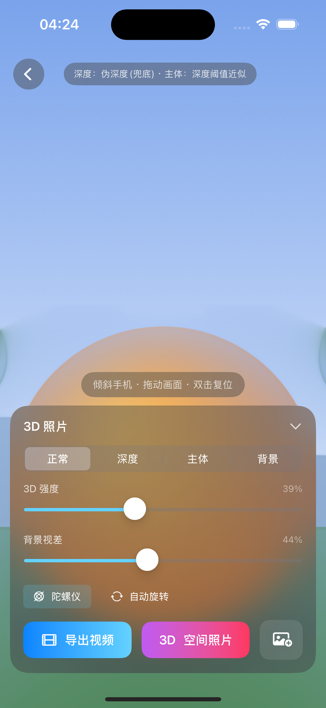
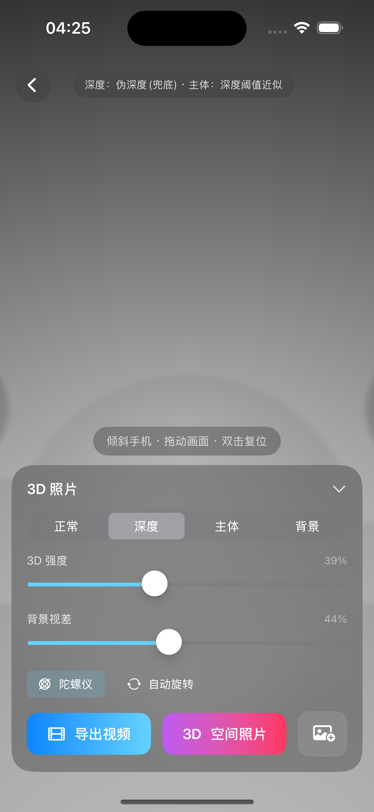
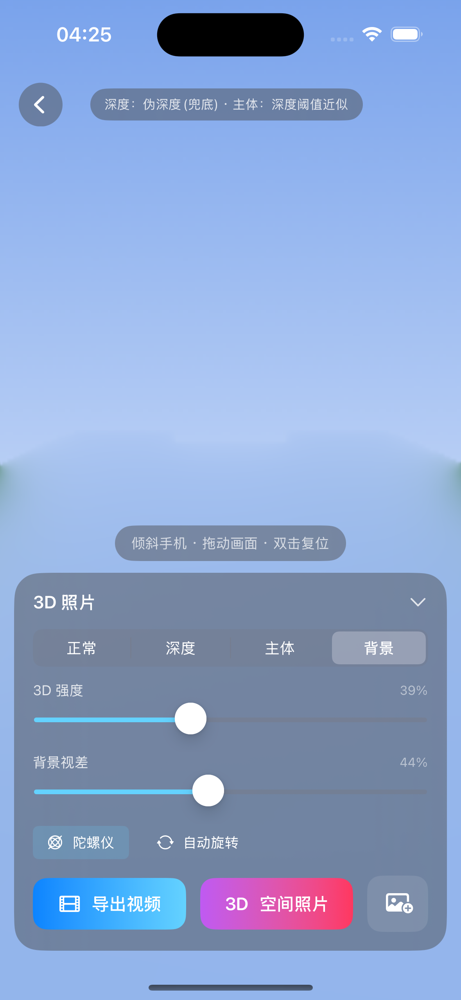

# Arcus — 端侧把一张照片变成 3D 照片

一个 iOS demo：在 **iPhone 本地**（离线、无服务端）把任意一张 2D 照片，转成可交互的 **3D 照片**——倾斜手机或拖动画面会产生**运动视差**，而且**移动主体后能看到主体背后被补全的背景**，达到接近 Apple「空间场景 / 景深效果」的观感。

| 3D 合成（正常） | 深度图 | 去除主体后补全的背景 |
|---|---|---|
|  |  |  |

> 右图是关键：前景主体被抠除后，原位置由周围背景**平滑补全**。当视差让主体「滑开」时，露出的就是这块补全像素——这正是「看到人背后」的效果来源。

## 两个核心问题的结论

1. **高斯泼溅（3DGS） vs 切片分层？** → 单图端侧 3D 照片用**分层（深度位移 / LDI）+ 去遮挡补全**，不要用 3DGS。3DGS 是「杀鸡用牛刀」，只在大幅环绕 / 视角相关反射时才值得；分层方案更轻、更快、效果对等。
2. **Apple 怎么做到「移动主体仍见背后」？** → **深度分层 + 去遮挡窄带补全**。关键洞察：视差只会沿主体轮廓暴露**一条与像素视差等宽的窄带**，所以只需补这条「膨胀边缘环带」，因此能端侧秒级、低内存出片。

完整调研见 **[`docs/01-research.md`](docs/01-research.md)**（含对比矩阵、开源构件清单、参考资料）。

## 技术管线（全部端侧、一次性、结果缓存）

```
照片 ─► 单目深度(Depth Anything V2 Core ML / AVDepthData / 伪深度兜底)
      ─► 主体分割(VNGenerateForegroundInstanceMaskRequest / 人物分割 / 深度阈值兜底)
      ─► 去遮挡补全(膨胀窄带 + Metal/CPU push-pull 把主体背后的 color+depth 补全)
      ─► 烘焙成「前景层 + 补全背景层」两张深度纹理
      ─► Metal 两层视差实时渲染(陀螺仪 CMMotion + 拖拽手势驱动)
      ─► 导出 视差视频(mp4) / 空间照片(立体 HEIC, 可上 Vision Pro)
```

架构细节见 **[`docs/02-architecture.md`](docs/02-architecture.md)**。

## 快速开始

```bash
# 1) 下载 Core ML 深度模型（~50MB，未纳入 git）
./scripts/download_models.sh

# 2) 打开工程，选 iOS 17+ 真机或模拟器，⌘R 运行
open Arcus.xcodeproj
```

命令行编译校验：

```bash
xcodebuild -project Arcus.xcodeproj -scheme Arcus \
  -destination 'generic/platform=iOS Simulator' -configuration Debug build
```

更多见 **[`docs/03-build-and-run.md`](docs/03-build-and-run.md)**。

## 特点

- **纯系统框架，零第三方依赖**（SwiftUI / Vision / CoreML / Metal / CoreMotion / AVFoundation / ImageIO）。唯一外部资产是运行时下载的 Core ML 深度模型。
- **健壮兜底**：无模型→伪深度；模拟器无分割→深度阈值近似；人像/LiDAR 照片→优先用自带 `AVDepthData`。任何情况都能出 3D，不崩。
- **快**：Release 下整条管线在 768×1024 约 **0.3s**（真机带 ANE 模型 ~0.5–0.8s）。
- **可导出**：视差循环视频 + 可在 Apple Vision Pro 查看的立体空间照片。

## 工程结构

```
docs/                调研报告 / 架构 / 构建运行 / 截图
scripts/             模型下载脚本
Arcus.xcodeproj   Xcode 工程（文件系统同步组）
Arcus/
  App/               入口
  Core/              Metal 上下文 / Float 图像缓冲 / 纹理与图像 IO / 示例图
  Pipeline/          深度 / 分割 / 去遮挡补全 / 烘焙编排
  Rendering/         Metal 两层视差渲染器 + 运动控制 + 着色器
  Export/            视差视频 / 空间照片 / 相册保存
  UI/                SwiftUI 界面
  Resources/         Assets + (运行时) Core ML 模型
```

## 致谢 / 复用的开源工作

技术与规范参考（非逐字搬运代码）：Depth Anything V2（Apple Core ML 转换）、3D Photo Inpainting (Shih et al. CVPR'20) 的 LDI 思路、One Shot 3D Photography 的端侧蓝图、`3dify-ios` / `iOS-Depth-Sampler` 的 iOS 集成范式。完整清单与许可见 [`docs/01-research.md` §4](docs/01-research.md)。
