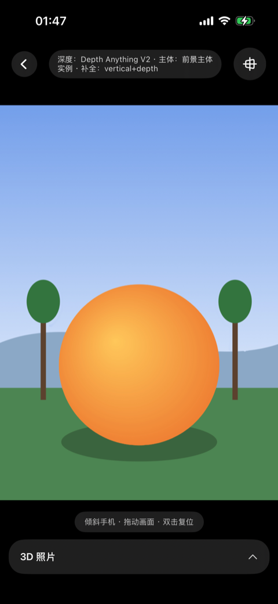
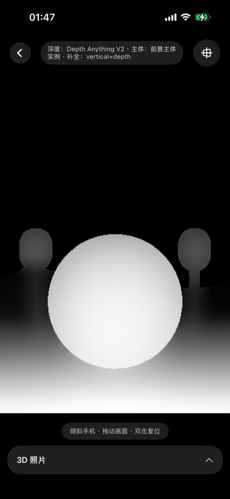
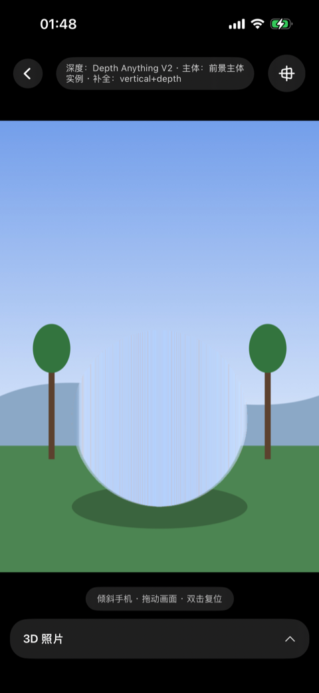
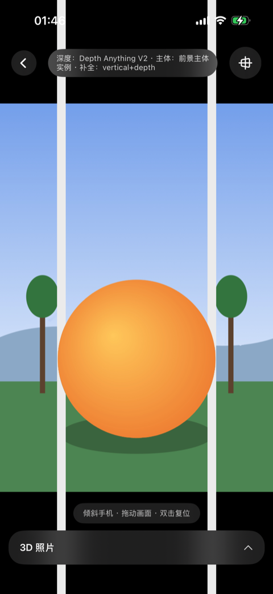
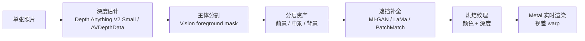

# Arcus

Arcus 是一个纯端侧 iOS 2D 转 3D 照片 Demo：只输入一张普通照片，在 iPhone 本地完成深度估计、主体分层、遮挡补全和 Metal 实时视差渲染，让照片可以随倾斜或拖动产生 3D 运动视差。

它不是要重建一个完整可行走的三维世界，而是面向照片消费场景，做一份足够轻、足够快、能在手机上实时互动的 3D 照片资产。

| 3D 预览 | 深度图 | 主体移开后的补全背景 | 出框效果 |
|---|---|---|---|
|  |  |  |  |

第三张图是核心：前景主体被移开后，原本被挡住的区域由算法补出。当视差让主体“滑开”时，露出来的不是空洞，而是这块预先补好的背景。

## 核心能力

- **3D 照片预览**：拖动或倾斜手机时，近处移动多、远处移动少，形成运动视差。
- **遮挡补全**：主体让开后，露出的是补好的背景，而不是拉伸纹理或空洞。
- **空间重构**：在更大视角变化下重新选择机位，并对新视角缺失区域做补全。
- **出框效果**：在背景与主体之间绘制静止画框条，形成裸眼 3D 出框错觉。
- **导出能力**：支持视差循环视频、空间照片、重构后的补全成片。
- **全端侧运行**：无服务端、无云端推理，模型缺失时也有降级路径。

## 技术路线

照片级 2D 转 3D 可以理解成两段：**先离线生成一份可渲染的 3D 资产，再在预览时实时改变观察角度**。用户选中照片后，系统完成深度估计、分层组织和遮挡补全；进入预览后，模型不再每帧运行，GPU 只根据新的观察角度快速重绘。



Arcus 的表示更接近 **LDI / 分层 2.5D**，而不是 MPI 或完整 3DGS。原因很直接：手机 3D 照片的视角变化通常很小，不需要重建完整三维世界；把主体、中景、背景拆成少量带深度的层，再补齐轮廓旁会露出的窄带，已经能覆盖主要体验。

## 模型与降级

每个模型都是可选项。缺少模型会降低效果，但不应该导致 App 崩溃。

| 阶段 | 优先路径 | 降级路径 |
|---|---|---|
| 深度估计 | `AVDepthData` 或 Depth Anything V2 Small Core ML | 伪深度 |
| 主体分割 | `VNGenerateForegroundInstanceMaskRequest` | 深度阈值分割 |
| 遮挡补全 | MI-GAN / LaMa | PatchMatch / push-pull / planar / vertical fill |
| 实时渲染 | Metal 连续网格 warp | 深度、主体、背景、fill mask 调试层 |

Arcus 当前默认路线是：先用 Depth Anything V2 Small 做单目深度估计，再用 Vision 前景分割拆出主体和背景，对遮挡区域用 MI-GAN、LaMa 或 PatchMatch 做补全，最后把前景、背景和深度烘焙成可由 Metal 实时渲染的分层资产。

## 渲染方式

Arcus 的渲染不是把几张平面简单沿 Z 轴位移。每层都是一张连续的 image-UV 网格，顶点着色器会采样逐像素视差，并把屏幕位置向前 warp。

前景网格会在主体轮廓和深度断层处切开，切开后露出的就是补好的背景。主体还会绕质心做轻微放大，用来覆盖遮挡补全的过渡带，减少边缘穿帮。

## 空间重构

空间重构可以理解为把同一条管线推到更大的视角变化下使用。普通 3D 照片只是让画面轻微动起来；空间重构允许用户重新选择机位，因此被推出画面、被前景遮住后重新露出的区域更多，也更依赖补全能力。

Apple 目前没有公开 Spatial Reframing 的具体实现细节，但公开研究已经给出了相近的问题拆解：

- [3D Ken Burns Effect from a Single Image](https://arxiv.org/abs/1909.05483)：单图估深度、生成点云、移动虚拟相机，并补齐新视角露出的颜色和深度。
- [3D Photo Inpainting](https://shihmengli.github.io/3D-Photo-Inpainting/)：基于 LDI 的颜色与深度补全，直接解释“主体背后是什么”这个问题。
- [Diffuse3D](https://github.com/yutaojiang1/Diffuse3D) 和 [Stable Virtual Camera](https://stable-virtual-camera.github.io/)：用扩散模型处理更大视角变化下的新视角生成。
- [Apple SHARP](https://apple.github.io/ml-sharp/)：单图前馈生成 3D Gaussian 表示，并实时渲染附近视角。

Arcus 的 Spatial Reframe 是一个轻量复刻：先让用户拖动虚拟相机预览新构图，再渲染所选视角并生成 hole mask，最后调用补全模型生成新视角成片。

## 快速开始

```bash
# 1. 下载可选 Core ML 模型
# Depth Anything V2 Small F16 (~48MB) + LaMa (~38MB)
./scripts/download_models.sh

# 2. 可选：本地转换 MI-GAN，启用 AI 补全档
# 详见 scripts/convert_migan.py 顶部说明

# 3. 打开 Xcode 工程，选择 iOS 17+ 真机或模拟器运行
open Arcus.xcodeproj
```

命令行编译校验：

```bash
xcodebuild -project Arcus.xcodeproj -scheme Arcus \
  -destination 'generic/platform=iOS Simulator' -configuration Debug build
```

真机构建：

```bash
xcodebuild -project Arcus.xcodeproj -scheme Arcus \
  -destination 'generic/platform=iOS' -configuration Release -allowProvisioningUpdates build
```

陀螺仪视差和系统主体分割依赖真机能力。模拟器会自动回退到深度阈值分割，并且没有陀螺仪输入。

## 性能说明

性能必须在 **Release + 真机** 上判断。管线里有大量逐像素 CPU 循环，包括深度后处理、补全和重采样；Debug(`-Onone`)可能慢 30-50 倍。

Release 真机路径下，768x1024 图片通常可以在亚秒级完成处理，具体耗时取决于模型是否存在和补全模式。日志格式：

```text
[Pipeline] 完成 WxH 用时 ...s
```

## 工程结构

```text
assets/              README 截图
scripts/             模型下载与 MI-GAN 转换脚本
Arcus.xcodeproj      Xcode 工程
Arcus/
  App/               入口
  Core/              FloatImage、MetalContext、TextureIO、图像工具
  Pipeline/          深度估计、主体分割、遮挡补全、资产烘焙
  Rendering/         Metal 渲染器、网格构建、运动控制、着色器
  Export/            视差视频、空间照片、相册保存
  UI/                SwiftUI 首页、处理页、编辑器、重构与导出界面
  Resources/         Assets 与可选 Core ML 模型
```

## 开发约束

- 部署目标：iOS 17.0。
- 依赖：只使用系统框架，包括 SwiftUI、Vision、CoreML、Metal、CoreMotion、AVFoundation、ImageIO、Photos。
- 不引入第三方 SPM / Pod 依赖。
- `Arcus/Resources/*.mlpackage/` 为本地下载或转换的模型文件，不提交到仓库。
- Xcode 工程使用 file-system-synchronized groups，新增到 `Arcus/` 下的 Swift 文件会自动纳入 target。

## 从语言到 Demo

Arcus 也是一次 AI Coding 实验。去年尝试做类似项目时，花了一个月也只有粗糙雏形；现在只靠自然语言描述目标、持续反馈效果，就能在很短时间里把深度估计、遮挡补全和 Metal 渲染串成一个可交互 Demo。

但 Coding 不只是为了得到一个结果，它本身也是理解问题的过程。就像 AI 可以替我们总结一本书，但亲自读一本书，会在停顿、困惑、反驳和联想里形成自己的判断。写代码也是一样，AI 可以帮我们更快跑通 Demo，但过程里暴露出来的取舍、错误和修正，才真正让人理解一个系统。

## 参考资料

- [Depth Anything V2](https://arxiv.org/abs/2406.09414)
- [3D Photo Inpainting](https://shihmengli.github.io/3D-Photo-Inpainting/)
- [One Shot 3D Photography](https://arxiv.org/abs/2008.12298)
- [LaMa](https://arxiv.org/abs/2109.07161)
- [MI-GAN](https://github.com/Picsart-AI-Research/MI-GAN)
- [3D Gaussian Splatting](https://repo-sam.inria.fr/fungraph/3d-gaussian-splatting/)
- [Apple SHARP](https://apple.github.io/ml-sharp/)
