# Arcus：从单张照片生成端侧 3D 照片

Arcus 是一个纯端侧 iOS 2D 转 3D 照片 Demo。它只输入一张普通照片，在 iPhone 本地完成深度估计、主体分层、遮挡补全和 Metal 实时视差渲染，让照片可以随倾斜、拖动或重构视角产生 3D 运动视差。

这份 README 来自一篇关于端侧 2D 转 3D 技术演进的分享稿。它不只介绍怎么运行项目，也尽量解释 Arcus 背后的问题：为什么这两年 2D 转 3D 产品突然集中出现，一张普通照片为什么能变成立体照片，以及 Arcus 为什么选择分层 2.5D 路线。

<p align="center">
  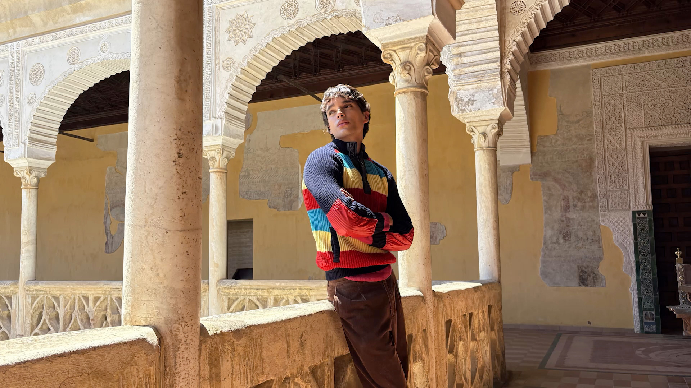
</p>

<p align="center"><em>Apple Spatial Scenes：普通 2D 照片被重新组织成可“探头看”的 3D 场景。</em></p>

## 项目一句话

**Arcus 是一个纯端侧 iOS 2D 转 3D 照片 Demo，技术路线接近 LDI / 分层 2.5D：先用 Depth Anything V2 Small 做单目深度估计，再用 Vision 前景分割拆出主体和背景，对遮挡区域用 MI-GAN、LaMa 或 PatchMatch 做补全，最后把前景、背景和深度烘焙成可由 Metal 实时视差渲染的分层资产。**

## 为什么是现在

2026 年 6 月 8 日，Apple 在 WWDC26 发布了空间重构(Spatial Reframing)：照片拍完之后，用户可以拖动画面重新选择机位，系统实时补全新视角缺失的内容。它延续了过去两年消费级 2D 转 3D 产品的集中爆发。

| 时间 | 产品或技术节点 | 关键变化 |
|---|---|---|
| 2024-06 | visionOS 2 空间照片 | 2D 照片开始在 Vision Pro 上被转为空间照片 |
| 2025-06 | iOS 26 / visionOS 26 Spatial Scenes | 普通 2D 照片可以产生可“探头看”的 3D 场景 |
| 2025-12 | Apple SHARP | 单张照片一次前馈生成 3D Gaussian 表示，附近视角实时渲染 |
| 2026-06 | Spatial Reframing | 从“看 3D 照片”推进到“重新选择机位并补全新视角” |

这条线背后有三项能力同时成熟：

1. **单目深度估计基础模型化**：无需双摄或激光雷达，仅凭一张普通照片推断每个像素的远近。Depth Anything V2 Small 这类小模型已经足够作为手机端轻量前处理。
2. **3D 表示变得更适合实时渲染**：从 LDI、MPI 到 NeRF、3D Gaussian Splatting，核心目标都是把一张或多张图组织成可以换视角的结构。
3. **移动端 NPU 和 GPU 算力足够用**：深度估计、图像补全和实时预览不再必须依赖云端，可以在手机或头显上完成。

## 立体感来自视差

人脑通过双眼看到的画面差异来感知深度，这个差异就是视差。2D 转 3D 的本质，不是先生成一个完整 3D 模型，而是构造出人眼能够感知的视差信号。

一个简单实验就能说明：伸直手臂竖起拇指，交替闭上左右眼。拇指会相对远处背景左右“跳动”。这是因为两只眼睛相隔约 6cm，相当于从两个相邻机位各拍了一张照片；同一个物体在两张画面里错开的距离，就是视差。

视差大小由几何关系决定：观察点移动同样的距离，近处物体的画面位置变化更大，远处物体变化更小。半米处的拇指会明显跳动，10m 外的背景几乎不动。

<p align="center">
  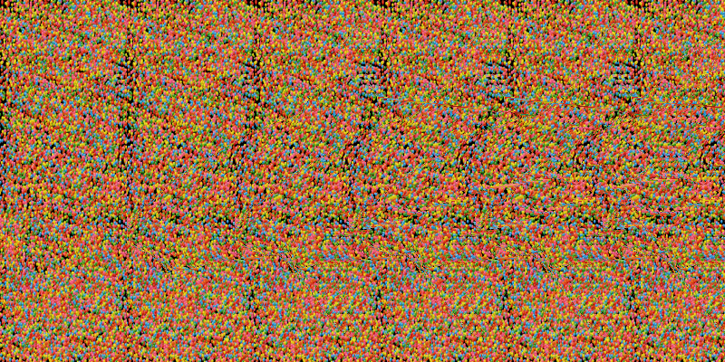
</p>

<p align="center"><em>随机点魔眼图：没有轮廓、明暗和透视，只靠双眼看到的点阵错位，大脑也能恢复出 3D 鲨鱼。</em></p>

视差可以简化写成：

$$d = \frac{W}{2\tan(FOV/2)} \cdot \frac{B}{Z}$$

其中：

| 符号 | 含义 | 对 2D 转 3D 的意义 |
|---|---|---|
| W | 画面宽度 | 同样的角度变化，像素越多，位移像素越多 |
| FOV | 视场角 | 决定立体感强弱，不改变谁近谁远 |
| B | 基线 | 双摄时是镜头间距；单图转换时是算法虚拟出的左右眼距离 |
| Z | 物体到相机的距离 | 照片里没有，需要模型估计 |

前三个量通常可以看作已知或可设定，真正缺的是每个像素的 Z。所以可以记住一句话：**视差和距离成反比，物体越近，视差越大；物体越远，视差越小。**

于是 2D 转 3D 被压缩成两个问题：

1. **深度从哪里来**：怎么从一张普通照片里估出每个像素的远近。
2. **视差怎么画出来**：拿到深度之后，怎么让近处移动得多、远处移动得少，并处理移动后露出来的空洞。

真正决定观感的往往是第二个问题。深度只能告诉我们“哪些像素该怎么动”，但当前景让开之后，背后原本被挡住的内容并不存在于照片里。这个区域必须被补出来。

## 显示方式与格式

算出来的视差最终要交给显示系统，让人眼感知。

| 设备形态 | 做法 | 代表 |
|---|---|---|
| 手机单屏裸眼 | 左右眼看到同一帧，立体感主要来自运动视差。用户倾斜手机或拖动画面时，虚拟视点连续移动，用时间上的晃动替代双眼同时看到的空间差异。 | iOS Spatial Scenes、Arcus |
| 头显双目显示 | 同一时刻分别给左右眼渲染两张略有差异的图，双眼直接融合出立体感。 | Vision Pro、Galaxy XR、XReal |

<p align="center">
  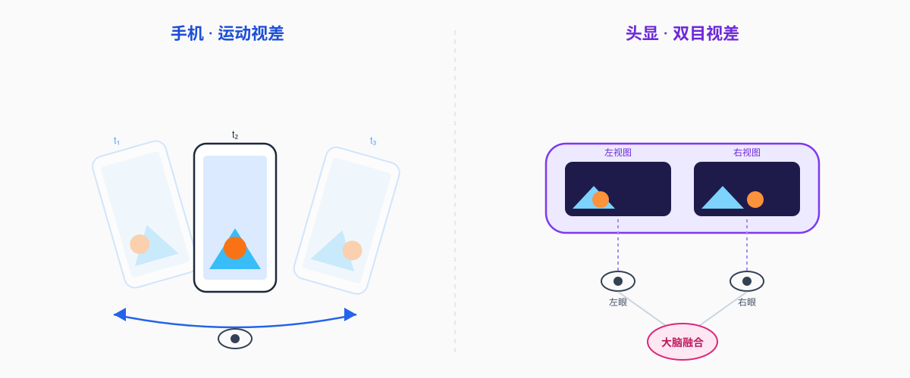
</p>

载体格式也随之分化：

- **空间照片**：本质是一组左右眼图像，也就是一个“立体对”。Apple 会把它封装进 HEIC 文件，并写入基线、视场角和视差调整等空间元数据。
- **空间视频**：通常使用 MV-HEVC，也就是 HEVC / H.265 的多视图扩展。普通 2D 播放器只读取基础视图，支持 3D 的设备再读取另一视图或视差信息。

<p align="center">
  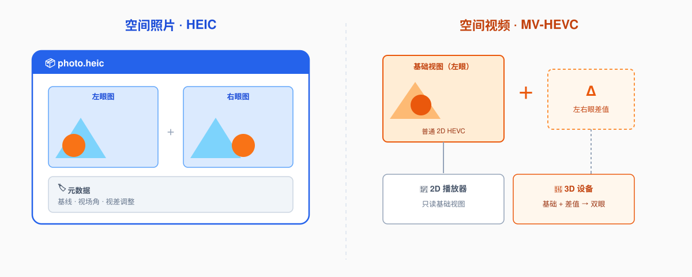
</p>

从 iPhone 15 Pro / 15 Pro Max 开始，Apple 可以用主摄和超广角双镜头直接拍摄空间视频，属于“双目直拍”。Arcus 关注的是另一条路线：**单目转换**，也就是把已经存在的大量普通 2D 照片带进 3D。

## 表示 3D 的方式

### LDI 和 MPI：分层 2.5D

LDI 和 MPI 都属于分层表示，区别在于怎么分层、内容存在哪里。

| 表示 | 怎么存 | 适合解释 |
|---|---|---|
| LDI(Layered Depth Images) | 沿每条视线往里存多层带深度的颜色样本 | 同一个像素位置背后还有什么 |
| MPI(Multiplane Image) | 把整张图分配到一组全局共享的固定深度平面上 | 一摞有深度间距的透明玻璃片 |

| LDI | MPI |
|---|---|
|  |  |

LDI 可以理解为：普通图片的一个像素位置只存一个颜色；LDI 允许同一个像素位置存多张带深度标签的小卡片。第一张通常来自原图可见像素；如果前景背后还有墙、树、天空这类被遮挡内容，单图 2D 转 3D 里就要靠深度估计、主体分割和图像补全把它们推断出来，再作为后面的卡片存进去。

MPI 则是在相机前方放一组固定深度的平行透明平面，再由网络或算法根据输入图像，为每个平面预测一张 RGBA 图。换视角时，每个平面按自己的深度重新投影：近处平面移动更多，远处平面移动更少，最后从远到近透明叠加，形成立体感。

分层路线的世界观是：**3D 照片约等于 2.5D**。它有点像纸片剧场：近景、中景、远景被拆成几块前后错开的布景板，观众左右晃头时，不同布景板移动幅度不同，于是产生立体感。它不是为了让人真的走进场景，而是为手机上这种小幅换视角准备刚好够用的层。

这一代里最值得单独点名的是 [One Shot 3D Photography](https://arxiv.org/abs/2008.12298)。它走 LDI 路线：轻量深度网络估深度，照片转换成 LDI，补齐视差会露出的遮挡边缘，最后预计算成纹理图集和网格，交给手机 GPU 实时渲染。它证明了单图 3D 照片不必依赖云端，也不必依赖双摄。

| Google Cinematic Photos | One Shot 3D Photography |
|---|---|
| 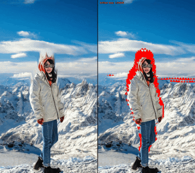 | 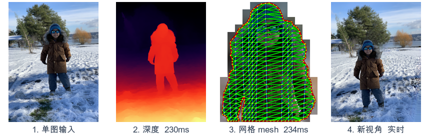 |

### NeRF：把场景训练进一个函数

如果说 LDI 和 MPI 是把场景拆成纸片或玻璃片，NeRF(Neural Radiance Fields)则换了一种更激进的思路：不再直接保存图片、网格或一层层平面，而是把一个场景训练进一个神经网络里。

可以把 NeRF 理解成一个“记住了某个房间的函数”。你给它一个 3D 坐标，再告诉它从哪个方向看，它就回答：这里是什么颜色，以及这里有多像实体、会不会挡住后面的光。

网络输出颜色 RGB 和密度 σ。渲染一张图时，每个像素都会从相机发出一条光线，系统沿着这条光线采样很多点，再把这些点的颜色和密度从近到远累积起来，最后得到这个像素的颜色。

NeRF 证明了连续场可以用照片级质量表示真实 3D 场景。但它的原始形态不适合“相册里点一张照片马上生成 3D”：通常需要多张带相机位姿的照片，每个场景单独训练，渲染时还要对每个像素和采样点不断查询网络。

字节跳动与新加坡国立大学的 [MINE](https://arxiv.org/abs/2103.14910) 可以理解成 MPI 和 NeRF 之间的过渡形态。传统 MPI 只能预测固定数量的深度平面；MINE 保留“按深度生成平面”的思路，但把固定层改成连续查询。你给它任意连续深度 z，它都能生成这个深度位置上的一张 `(RGB, σ)` 平面。

### 3D Gaussian Splatting：从连续场回到实时渲染

[3D Gaussian Splatting](https://repo-sam.inria.fr/fungraph/3d-gaussian-splatting/) 换了一种更适合实时渲染的表示方式：它不再像 NeRF 那样把场景隐含在网络参数里，而是用大量带有位置、形状、颜色和透明度的 3D 高斯来近似真实世界。

渲染时，GPU 把这些 3D 高斯投影到屏幕上，变成一个个半透明椭圆斑点，再按深度顺序透明叠加。它能保留接近 NeRF 的画质，但不必在每个像素、每条光线上反复查询神经网络，因此更容易做到实时。

<p align="center">
  
</p>

3DGS 的代价主要在存储。一个真实场景往往需要百万级高斯，未压缩文件可能达到几十到几百 MB。因此，3DGS 要真正落到端侧，核心工程问题是剪枝、量化和压缩。

对 Arcus 来说，3DGS 很重要，但不是当前最合适的核心表示：手机照片的视角变化较小，分层 2.5D 更轻、更稳定，也更适合端侧快速预览。

## 深度估计模型

上面的表示法虽然形态不同，但都需要知道画面里每个像素大概离相机有多远。所以 2D 转 3D 这两年的进展，还有一条不那么显眼但非常关键的暗线：**单目深度估计终于变得更通用、更稳定。**

早期的单目深度估计很挑照片。模型在熟悉的数据集里效果不错，换一种光线、构图或物体，就容易把远近判断错。[MiDaS](https://arxiv.org/abs/1907.01341) 和 [DPT](https://arxiv.org/abs/2103.13413) 这类工作先把目标放宽：不急着估出“这个人离镜头 1.8 米”这种绝对距离，而是先把相对远近排对。

真正让产品侧更舒服的是 [Depth Anything V2](https://arxiv.org/abs/2406.09414)。它先用大量合成图训练强教师模型，再让教师给真实照片自动生成深度伪标签，最后把能力蒸馏到更小的学生模型里。V2 Small 只有 25M 参数，转成 Core ML 后几十 MB，已经足够作为手机端轻量前处理步骤。

| MiDaS / DPT 之前后的泛化变化 | Depth Anything V2 |
|---|---|
| 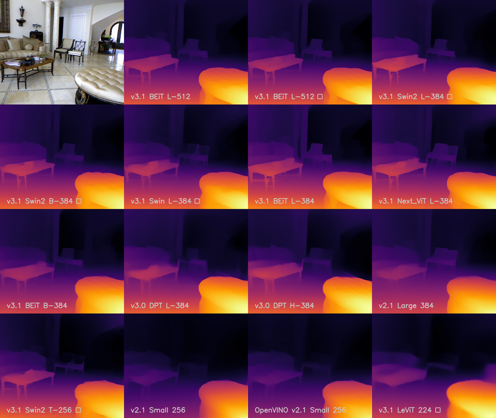 | 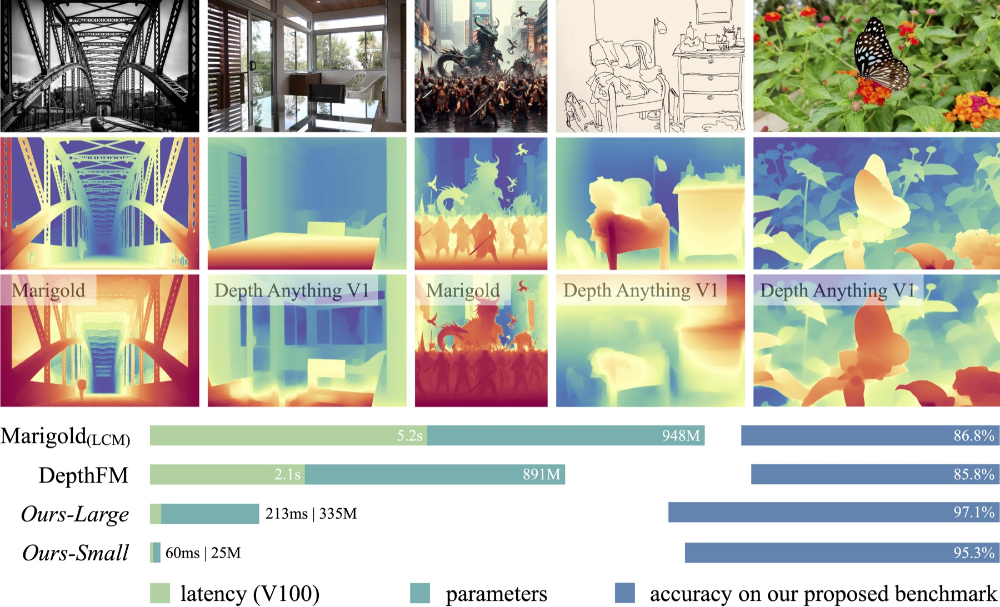 |

再往后，深度估计开始从单张图里的远近排序走向更完整的空间理解。[Depth Pro](https://arxiv.org/abs/2410.02073) 强调米制深度，[VGGT](https://arxiv.org/abs/2503.11651) 和 [Depth Anything 3](https://depth-anything-3.github.io/) 则进一步尝试一次性推断相机位置、画面中各点的 3D 坐标，以及这些点在多帧之间如何运动。

## 照片级 2D 转 3D 的产品管线

照片级 2D 转 3D 产品，可以理解成两段：**先离线生成一份可渲染的 3D 资产，再在预览时实时改变观察角度**。用户选中照片后，系统完成深度估计、分层组织和遮挡补全；等用户倾斜手机或拖动画面时，GPU 只根据新的视角快速重绘。


| 步骤 | 做什么 | 为什么重要 |
|---|---|---|
| 估深度 | 给照片生成深度图，判断哪里近、哪里远 | 近处多动、远处少动，形成视差 |
| 组织结构 | 把主体、中景、背景拆开，或转换成图层、网格、高斯等可重投影表示 | 一张平面照片才能被轻微换视角 |
| 遮挡补全 | 补出前景让开后露出的墙、树、天空等内容 | 不补就会出现空洞或纹理拉伸 |
| 实时渲染 | 预处理完成后，GPU 按当前手势或陀螺仪重新投影 | 模型不用每帧运行，交互才能实时 |

<p align="center">
  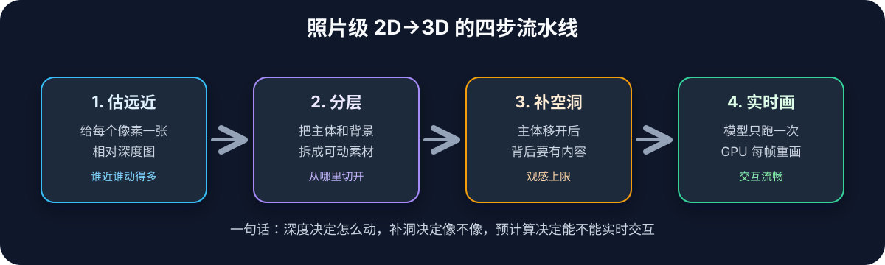
</p>

空间重构把这条流程推到更大的视角变化下使用。机位挪得越大，被推出画面、被前景遮住后重新露出的区域就越多，因此更依赖补全能力。真正难的不是“把洞填上”这句话，而是判断哪些地方是洞，以及让补出的颜色和深度自然接回原场景。

Apple 目前没有公开 Spatial Reframing 的具体实现细节。但从官方描述看，它解决的问题和一批公开研究高度一致：

- [3D Ken Burns Effect from a Single Image](https://arxiv.org/abs/1909.05483)：单图估深度、生成点云、移动虚拟相机，并补齐新视角露出的颜色和深度。
- [3D Photo Inpainting](https://shihmengli.github.io/3D-Photo-Inpainting/)：基于 LDI 的颜色与深度补全，直接解释“主体背后是什么”这个问题。
- [Diffuse3D](https://github.com/yutaojiang1/Diffuse3D) 和 [Stable Virtual Camera](https://stable-virtual-camera.github.io/)：用扩散模型处理更大视角变化下的新视角生成。
- [Apple SHARP](https://apple.github.io/ml-sharp/)：单图前馈生成 3D Gaussian 表示，并实时渲染附近视角。

<p align="center">
  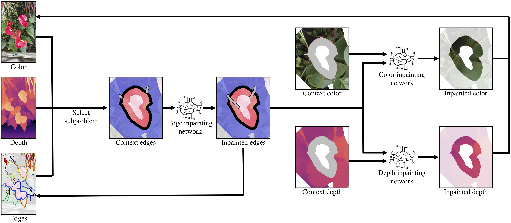
</p>

## Arcus 怎么落地

Arcus 对上面这条链路做了一个纯端侧版本：


| 模块 | Arcus 实现 | 降级路径 |
|---|---|---|
| 深度估计 | `AVDepthData` 或 Depth Anything V2 Small Core ML | 伪深度 |
| 主体分割 | `VNGenerateForegroundInstanceMaskRequest` | 深度阈值分割 |
| 遮挡补全 | MI-GAN / LaMa | PatchMatch / push-pull / planar / vertical fill |
| 实时渲染 | Metal 连续网格 warp | 深度、主体、背景、fill mask 调试层 |

渲染不是把几张平面简单沿 Z 轴位移。每层都是一张连续 image-UV 网格，顶点着色器采样逐像素视差，并把屏幕位置向前 warp。前景网格在主体轮廓和深度断层处切开，切开后露出的就是补好的背景。

| 原图 | 深度 | 主体 | 背景补全 |
|---|---|---|---|
|  | 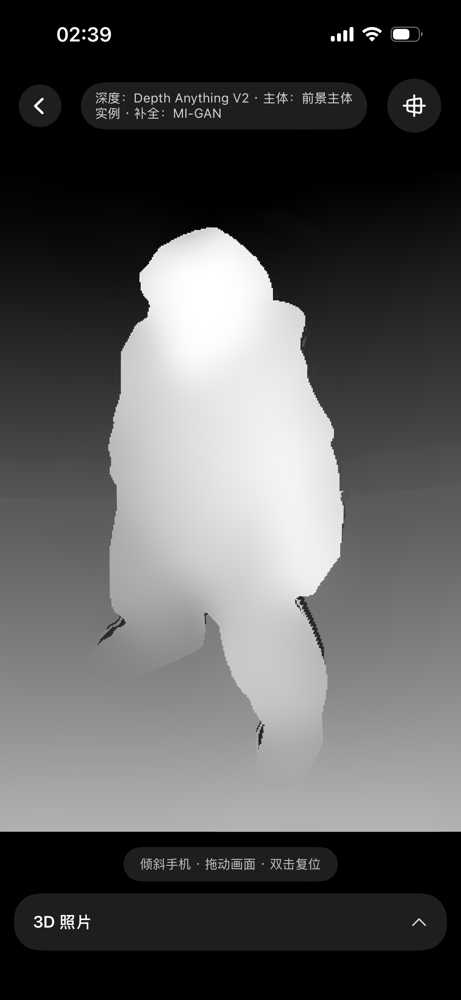 |  | 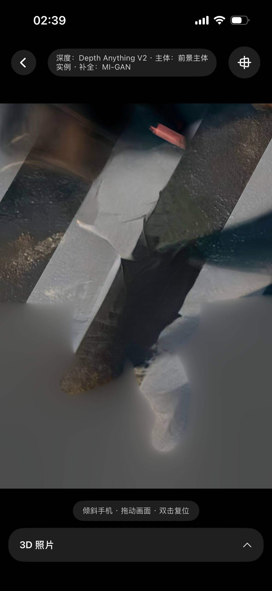 |
| 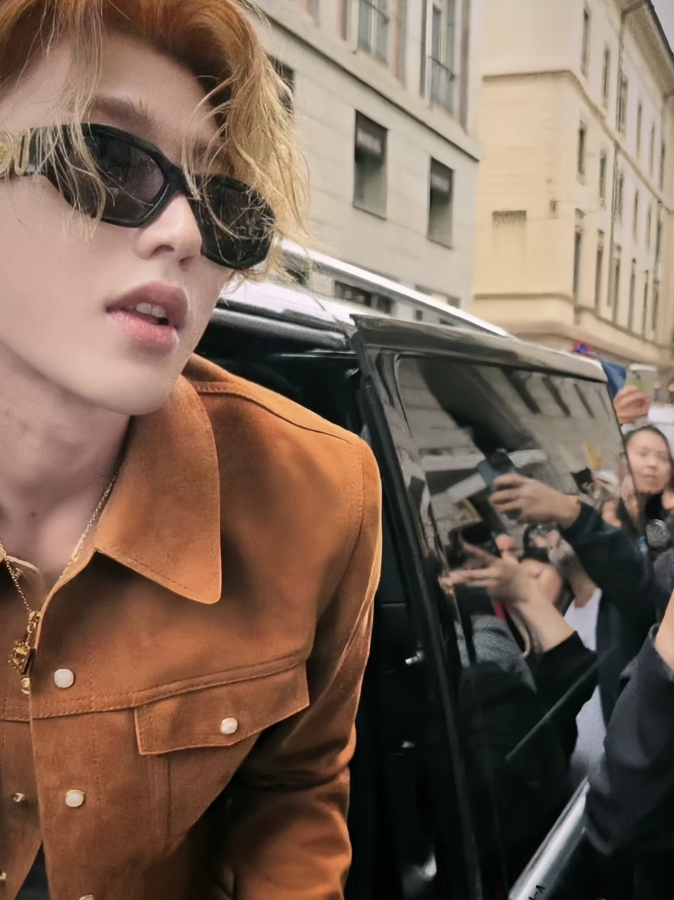 |  |  | 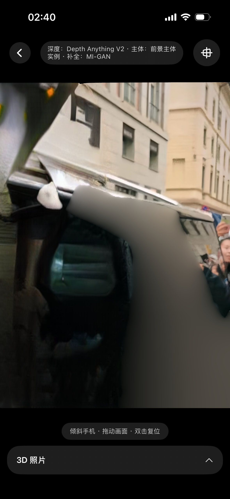 |

| 示例 | 空间照片 | 空间重构 |
|---|---|---|
| 1 | [查看 MP4](assets/readme/arcus-1-spatial-photo.mp4) | [查看 MP4](assets/readme/arcus-1-spatial-reframe.mp4) |
| 2 | [查看 MP4](assets/readme/arcus-2-spatial-photo.mp4) | [查看 MP4](assets/readme/arcus-2-spatial-reframe.mp4) |

Arcus 还包含两个扩展实验：

- **空间重构**：让用户拖动虚拟相机选择新构图，渲染所选视角并生成 hole mask，再调用补全模型生成新视角成片。
- **出框效果**：在背景与主体之间绘制静止画框条，主体随视差跨到条前，形成裸眼 3D 出框错觉。

## 快速开始

```bash
# 1. 下载可选 Core ML 模型
# Depth Anything V2 Small F16 (~48MB) + LaMa (~38MB)
./scripts/download_models.sh

# 2. 可选：本地转换 MI-GAN，启用 AI 补全档
# 详见 scripts/convert_migan.py 顶部说明

# 3. 打开 Xcode 工程，选择 iOS 17+ 真机或模拟器运行
open Arcus.xcodeproj
```

命令行编译校验：

```bash
xcodebuild -project Arcus.xcodeproj -scheme Arcus \
  -destination 'generic/platform=iOS Simulator' -configuration Debug build
```

真机构建：

```bash
xcodebuild -project Arcus.xcodeproj -scheme Arcus \
  -destination 'generic/platform=iOS' -configuration Release -allowProvisioningUpdates build
```

陀螺仪视差和系统主体分割依赖真机能力。模拟器会自动回退到深度阈值分割，并且没有陀螺仪输入。

## 性能说明

性能必须在 **Release + 真机** 上判断。管线里有大量逐像素 CPU 循环，包括深度后处理、补全和重采样；Debug(`-Onone`)可能慢 30-50 倍。

Release 真机路径下，768x1024 图片通常可以在亚秒级完成处理，具体耗时取决于模型是否存在和补全模式。日志格式：

```text
[Pipeline] 完成 WxH 用时 ...s
```

## 工程结构

```text
assets/              README 素材
scripts/             模型下载与 MI-GAN 转换脚本
Arcus.xcodeproj      Xcode 工程
Arcus/
  App/               入口
  Core/              FloatImage、MetalContext、TextureIO、图像工具
  Pipeline/          深度估计、主体分割、遮挡补全、资产烘焙
  Rendering/         Metal 渲染器、网格构建、运动控制、着色器
  Export/            视差视频、空间照片、相册保存
  UI/                SwiftUI 首页、处理页、编辑器、重构与导出界面
  Resources/         Assets 与可选 Core ML 模型
```

## 开发约束

- 部署目标：iOS 17.0。
- 依赖：只使用系统框架，包括 SwiftUI、Vision、CoreML、Metal、CoreMotion、AVFoundation、ImageIO、Photos。
- 不引入第三方 SPM / Pod 依赖。
- `Arcus/Resources/*.mlpackage/` 为本地下载或转换的模型文件，不提交到仓库。
- Xcode 工程使用 file-system-synchronized groups，新增到 `Arcus/` 下的 Swift 文件会自动纳入 target。

## 从语言到 Demo

Arcus 也是一次 AI Coding 实验。去年尝试做类似项目时，花了一个月也只有粗糙雏形；现在只靠自然语言描述目标、持续反馈效果，就能在很短时间里把深度估计、遮挡补全和 Metal 渲染串成一个可交互 Demo。

但 Coding 不只是为了得到一个结果，它本身也是理解问题的过程。就像 AI 可以替我们总结一本书，但亲自读一本书，会在停顿、困惑、反驳和联想里形成自己的判断。写代码也是一样，AI 可以帮我们更快跑通 Demo，但过程里暴露出来的取舍、错误和修正，才真正让人理解一个系统。

## 参考资料

### 官方与产品

- WWDC26 Spatial Reframing：[Apple Newsroom](https://www.apple.com/newsroom/2026/06/apple-intelligence-brings-powerful-ai-capabilities-into-everyday-experiences/) · [AppleInsider](https://appleinsider.com/articles/26/06/08/spatial-reframing-will-fix-your-bad-iphone-photos-with-ios-27)
- iOS 26 / visionOS 26 Spatial Scenes：[iOS 26 Newsroom](https://www.apple.com/newsroom/2025/06/apple-elevates-the-iphone-experience-with-ios-26/) · [visionOS 26 Newsroom](https://www.apple.com/newsroom/2025/06/visionos-26-introduces-powerful-new-spatial-experiences-for-apple-vision-pro/)
- visionOS 2 Spatial Photos：[Apple Newsroom](https://www.apple.com/newsroom/2024/06/visionos-2-brings-new-spatial-computing-experiences-to-apple-vision-pro/)
- Google Photos Cinematic Photos：[发布公告](https://blog.google/products/photos/new-cinematic-photos-and-more-ways-relive-your-memories/) · [技术博客](https://research.google/blog/the-technology-behind-cinematic-photos/)
- Meta Hyperscape：[Connect 2024 官方回顾](https://www.meta.com/blog/connect-2024-keynote-recap-quest-3s-llama-3-2-ai-wearables-mixed-reality/) · [Hyperscape Capture](https://techcrunch.com/2025/09/17/meta-launches-hyperscape-technology-to-turn-real-world-spaces-into-vr/)

### 深度估计

- [MiDaS](https://arxiv.org/abs/1907.01341)
- [DPT](https://arxiv.org/abs/2103.13413)
- [Depth Anything V2](https://arxiv.org/abs/2406.09414)
- [Marigold](https://marigoldmonodepth.github.io/)
- [Depth Pro](https://arxiv.org/abs/2410.02073)
- [VGGT](https://arxiv.org/abs/2503.11651)
- [Depth Anything 3](https://depth-anything-3.github.io/)

### 表示与渲染

- [Layered Depth Images](https://szeliski.org/papers/Shade_LayeredDepthImages_SG98.pdf)
- [Stereo Magnification / MPI](https://arxiv.org/abs/1805.09817)
- [3D Ken Burns Effect from a Single Image](https://arxiv.org/abs/1909.05483)
- [3D Photo Inpainting](https://shihmengli.github.io/3D-Photo-Inpainting/)
- [One Shot 3D Photography](https://arxiv.org/abs/2008.12298)
- [NeRF](https://www.matthewtancik.com/nerf)
- [MINE](https://arxiv.org/abs/2103.14910)
- [3D Gaussian Splatting](https://repo-sam.inria.fr/fungraph/3d-gaussian-splatting/)
- [Apple SHARP](https://apple.github.io/ml-sharp/)

### 补全与端侧实现

- [LaMa](https://arxiv.org/abs/2109.07161)
- [MI-GAN](https://github.com/Picsart-AI-Research/MI-GAN)
- [Diffuse3D](https://github.com/yutaojiang1/Diffuse3D)
- [Stable Virtual Camera](https://stable-virtual-camera.github.io/)
