# 从 WWDC 26 空间重构(Spatial Reframing)再看端侧 2D 转 3D 的技术演进

2026 年 6 月 8 日，WWDC26 上苹果发布了**空间重构(Spatial Reframing)**：照片拍完之后，拖动画面重新选择机位，AI 实时补全新视角缺失的内容：

|  |  |
| --- | --- |
| <video src="assets/readme/lark-media-01.mp4" controls muted playsinline width="100%"></video> | 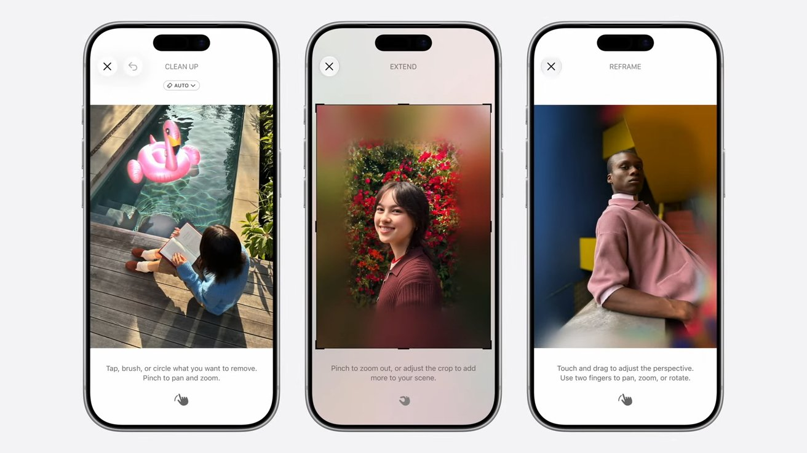 |

Users can improve the composition of a photo after it's been taken.([Apple Newsroom](https://www.apple.com/newsroom/2026/06/apple-intelligence-brings-powerful-ai-capabilities-into-everyday-experiences/)、[AppleInsider](https://appleinsider.com/articles/26/06/08/spatial-reframing-will-fix-your-bad-iphone-photos-with-ios-27))

头部玩家在两年内相继入场，这背后是三项能力趋于成熟：

1. **单目深度估计沉淀为基础模型**：无需双摄或激光雷达，仅凭一张普通照片推断每个像素的远近；过去这类模型更像“专用工具”，换个场景就容易失准；2024 年前后，香港大学与字节跳动的 [**Depth Anything V2**](https://arxiv.org/abs/2406.09414) **的** 25M 参数的 Small 版即能在手机上毫秒级出图；同期 ETH 的 [**Marigold**](https://marigoldmonodepth.github.io/) 把 Stable Diffusion 里已经学到的视觉世界知识迁移出来做深度估计。深度估计开始变成大视觉模型里可以复用的通用能力；
2. **3D 表示演化出端侧可实时运行的形态**：有了深度之后，还要把一张平面照片重新组织成“可换视角”的三维结构(分层、神经场、高斯泼溅等)；Facebook 的 [**One Shot 3D Photography**](https://arxiv.org/abs/2008.12298) 以“单目深度网络 + LDI 分层 + 遮挡区域补全”把一张普通照片直接在手机端处理成 3D Photo，几秒内就能预览和分享；从 [**3D Gaussian Splatting**](https://repo-sam.inria.fr/fungraph/3d-gaussian-splatting/) 至 [**Apple SHARP**](https://apple.github.io/ml-sharp/) 已经可以从单张照片一次前馈生成 3D Gaussian 表示，并在普通 GPU 上一秒内完成；
3. **移动端与头显的 NPU 算力开始溢出**：NPU 是手机和头显芯片里专门加速神经网络的单元。过去这类 2D 转 3D 任务要么依赖云端，要么只能离线慢慢处理；现在端侧 NPU 的算力已经足够支撑深度估计、图像补全和实时预览。苹果芯片内置的 ANE(Apple Neural Engine)承载 iPhone 上的 [iOS 26 空间场景](https://www.apple.com/newsroom/2025/06/apple-elevates-the-iphone-experience-with-ios-26/)，三星 Galaxy XR 所用的高通 [Snapdragon XR2+ Gen 2](https://www.qualcomm.com/products/mobile/snapdragon/xr-vr-ar/snapdragon-xr2-plus-gen-2-platform)(含 Hexagon NPU)支撑头显端实时转换，XReal 则以 [自研 X1 芯片](https://www.gizmochina.com/2025/12/02/xreal-1s-is-the-worlds-first-ar-glasses-with-automatic-2d-to-3d-video-conversion/) 驱动眼镜端的实时视频 2D 转 3D。

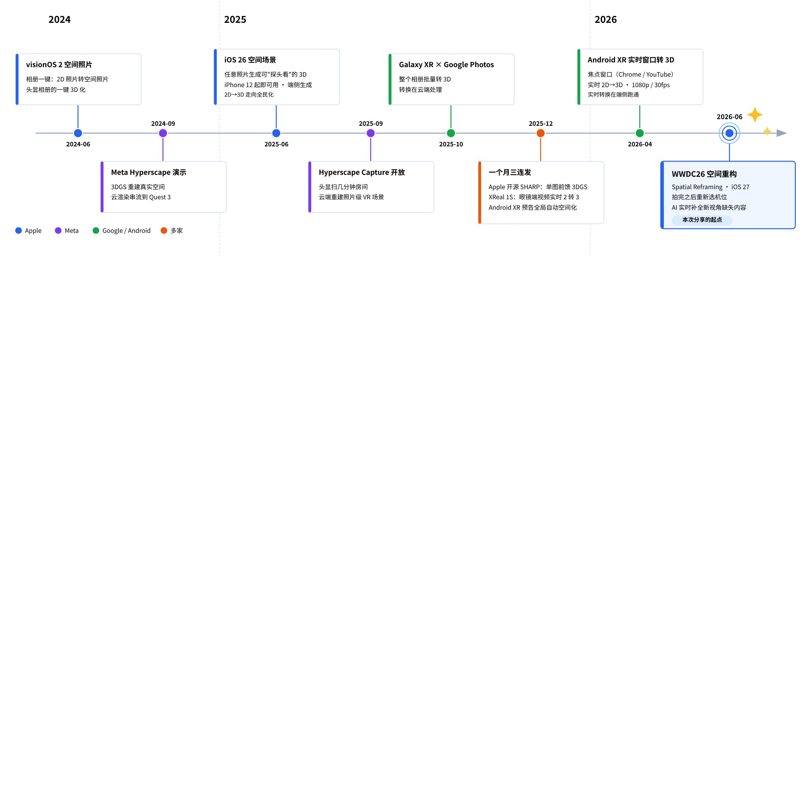

接下来，我们来看看一张普通照片是怎样被重新组织成可互动、可重构的新形态的。

# 视差带来的立体感

## 构造视差

人脑通过双眼看到的画面差异来感知深度，这个差异就是**视差(横向偏移)**。所以 2D 转 3D 的本质，是构造出人眼能够感知的视差信号。

可以做一个很简单的实验：伸直手臂竖起拇指，交替闭上左右眼。你会发现，拇指会相对远处背景左右“跳动”。这是因为两只眼睛之间大约相隔 6cm，相当于从两个相邻机位各拍了一张照片；同一个物体在两张画面里错开的距离，就是视差。

视差大小由几何关系决定：观察点移动同样的距离，近处物体的画面位置变化更大，远处物体的变化更小。半米处的拇指会明显跳动，10m 外的背景几乎不动；如果把拇指收近一半，它的跳动幅度大约也会翻倍。即**物体越近，视差越大；物体越远，视差越小**。大脑正是利用这个规律判断远近。火车窗外近处电线杆飞快掠过、远处山体缓慢移动，本质上也是同一件事。

> 随机点魔眼图是“立体感来自视差”的直接证据。图中没有轮廓、明暗和透视，只有随机噪点；但左右眼看到的点阵存在细微错位，大脑会把这种错位解释成深度，平行眼观看时便会浮现一只 3D 鲨鱼：
>
> 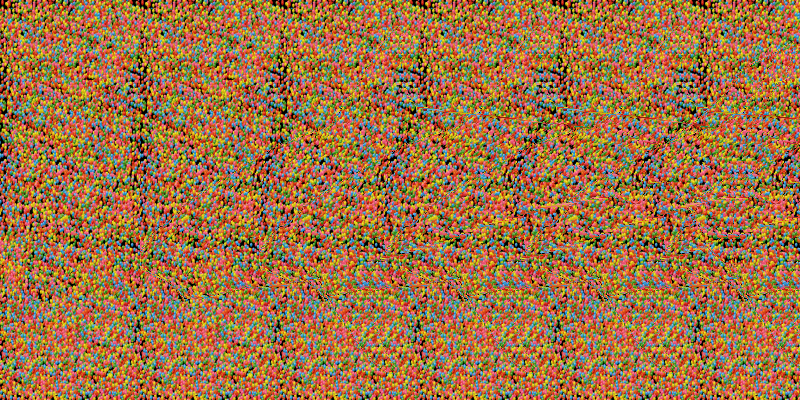
>
> 随机点魔眼图([Wikimedia Commons](https://commons.wikimedia.org/wiki/File:Stereogram_Tut_Random_Dot_Shark.png))

视差可以写成下面这个式子：

$$d = \frac{W}{2\tan(FOV/2)} \cdot \frac{B}{Z}$$

这里的 $d$ 是视差，单位是像素。只由四个量决定：

1. **W 画面宽度(像素数)**：同样的方向差，画面像素越多，折算出的位移像素就越多；
2. **FOV 视场角(Field of View)**：画面覆盖的角度范围，越大越“广角”。决定立体感多夸张，不改变深度关系；
3. **B 基线(Baseline)**：两个观察位置之间的距离。双摄拍摄时，它是两颗镜头的间距；单图转 3D 时，它是算法虚拟出来的左右眼距离，通常按人的瞳距量级来设，常见约 63mm。
4. **Z，物体离相机的距离**：照片里没有、需要 AI 去估算的数值。

对一张已经拍好的照片来说，画面宽度、视场角和基线基本都可以看作已知，真正缺的是每个像素的 Z：

**视差 ∝ 1/Z，物体越近，视差越大**。

于是，2D 转 3D 可以被拆成两个问题：

1. **深度从哪来：**也就是怎么从一张普通照片里估出每个像素的远近？(单目深度估计)
2. **视差怎么渲染：**拿到深度之后，怎么让近处移动得多、远处移动得少，并处理移动后露出来的空洞？

真正决定观感的往往是第二个问题。深度只能告诉我们“哪些像素该怎么动”，但当前景让开之后，背后原本被挡住的内容并不存在于照片里。这个区域必须被补出来。各家 2D 转 3D 方案的差异，绝大部分是对这个空洞问题的不同解答。

## 消费方式

算出来的视差要交给显示系统让人眼感知，不同设备的做法不一样：

1. **手机(单屏裸眼)**：左右眼看到的是同一帧画面，不能直接提供双目视差，所以立体感主要来自**运动视差**。当用户倾斜手机或拖动画面时，陀螺仪和手势会驱动虚拟视点连续移动，近处移动得多、远处移动得少。也就是说，它用时间上的连续晃动，替代了双眼同时看到的空间差异。iOS 26 Spatial Scenes 就是这种形态。
2. **头显(双目显示)**：设备可以在同一时刻分别给左右眼渲染两张略有差异的画面，双眼直接融合出立体感。Vision Pro、Galaxy XR、XReal 这类设备都属于这个形态。

|  |  |
| --- | --- |
| 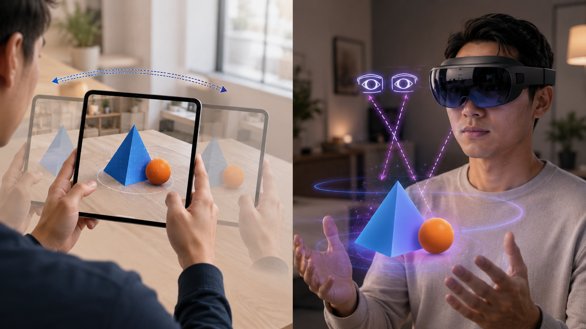 | 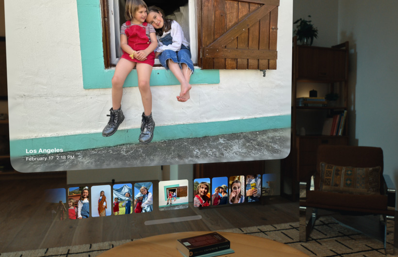 |

载体格式也随显示方式发生分化：

1. [**空间照片**](https://developer.apple.com/videos/play/wwdc2024/10166/)：本质是一组左右眼图像，也就是一个“立体对”。苹果会把这组图像封装进一个 [HEIC](https://support.apple.com/en-us/116944) 文件中。HEIC 是苹果常用的高效图片格式，基于 HEVC 编码，一个 `.heic` 文件里可以容纳多张图像；空间照片还会额外写入空间元数据，比如基线、视场角和视差调整参数。苹果在 [WWDC24](https://developer.apple.com/videos/play/wwdc2024/10166/) 中就是按这套方式定义空间照片的。
2. **空间视频**：通常使用 [MV-HEVC](https://developer.apple.com/videos/play/wwdc2023/10071/)，也就是 Multi-View HEVC，HEVC/H.265 的多视图扩展。它会把左右眼两路画面编码进同一个视频文件里：普通 2D 播放器只读取基础视图，仍然能当普通视频播放；支持 3D 的设备则读取额外的视差信息或另一视图，还原出双目画面。

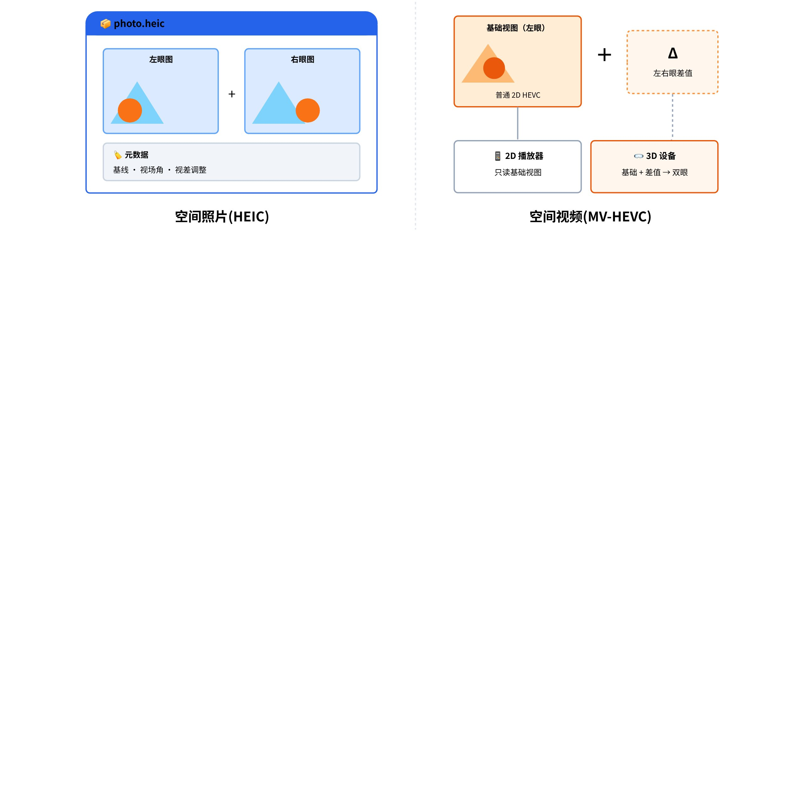

从 iPhone 15 Pro / 15 Pro Max 开始，苹果可以利用主摄和超广角两颗镜头直接拍摄空间视频，相当于在拍摄阶段就获得左右眼两路画面，属于“双目直拍”。但这次分享关注的“单目转换”，与此目标不同。

|  |  |
| --- | --- |
| 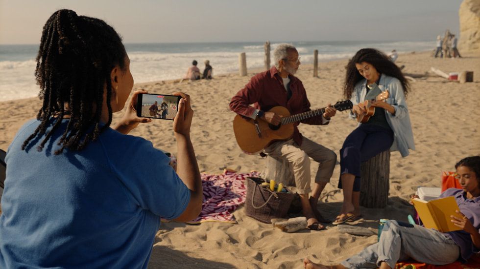 | 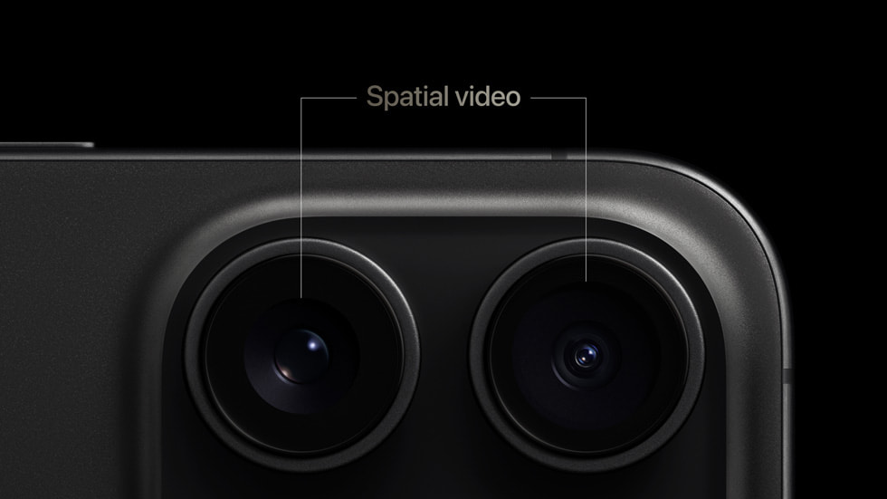 |

# 表示 3D 的方式

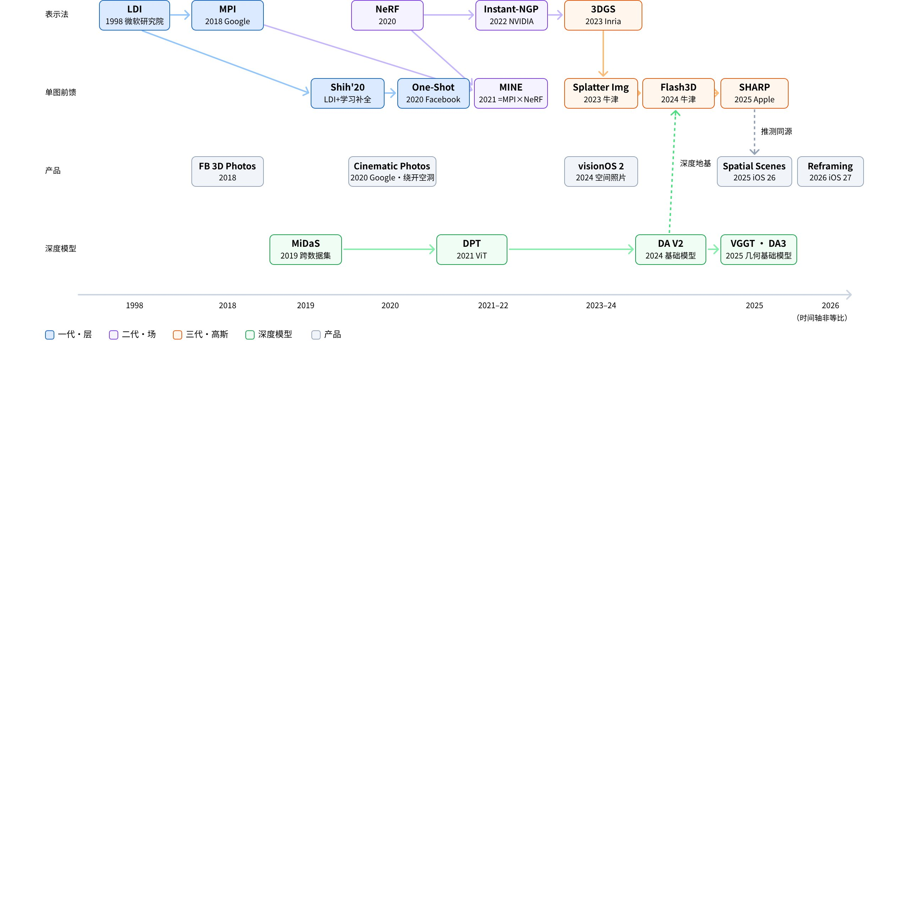

## LDI、MPI(1998–2022)

先理解两个核心概念 LDI 和 MPI，它们都属于“分层表示”，区别在于怎么分层、内容存在哪里：

1. **LDI(Layered Depth Images，分层深度图)**：普通图片的一个像素位置只存一个颜色；LDI 允许同一个像素位置存多张带深度标签的“小卡片”。第一张通常来自原图中可见的像素；如果前景背后还有墙、树、天空这类被遮挡内容，单图 2D 转 3D 里就需要结合深度估计、主体分割和图像补全，把这些内容推断出来，再作为更后面的卡片存进去。这样当主体在新视角下让开时，后面那层内容就能露出来，而不是直接变成空洞。
2. **MPI(Multiplane Image，多平面图像)**：可以理解为先在相机前方放一组固定深度的平行透明平面，典型做法大约是 32 层；再由网络或算法根据输入图像，为每个平面预测一张 RGBA 图。原图中可见的内容会根据深度分配到对应平面；被前景挡住、但换视角后可能露出的区域，也需要通过补全预测出来。换视角时，每个平面按自己的深度重新投影：近处平面移动更多，远处平面移动更少，最后从远到近透明叠加，形成视差和立体感。

**一句话总结，**LDI 是“沿着每条视线往里存多层内容”，MPI 是“把整张图的内容分配到一组全局共享的深度平面上”。渲染新视角时，两者都会把这些内容重新投影到屏幕上。

|  |  |
| --- | --- |
| 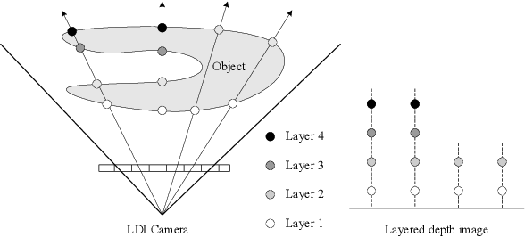 LDI：左侧  LDI Camera 沿每条视线穿过物体、记录命中的多层像素(Layer 1–4)，右侧即这些像素按深度堆成的 Layered Depth Image([Shade et al., SIGGRAPH'98](https://szeliski.org/papers/Shade_LayeredDepthImages_SG98.pdf)) | 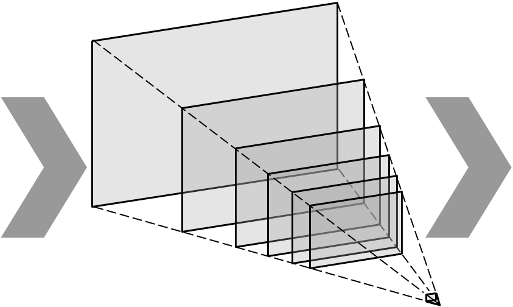 MPI：一摞带透明度的 RGBA 平面；新视角 = 每层按透视变形后，由远及近半透明叠加。生成慢、渲染快。([Single-View MPI](https://single-view-mpi.github.io/)) |

分层的世界观：**3D 照片 ≈ 2.5D**。通俗地说，它有点像“纸片人剧场”：近景、中景、远景被拆成几块前后错开的布景板，观众左右晃头时，不同布景板移动的幅度不同，于是产生立体感。它只为“小幅度换视角”准备刚好够用的层。优点是可以一次性预计算好，用传统光栅化渲染，手机上很容易做到实时；但视角一旦拉得太大，就容易出现纹理拉伸、层间接缝和补洞穿帮。

分层路线真正绕不开的问题，是“主体背后是什么”。当前景被挪开时，原图里被挡住的内容并不存在。Google Cinematic Photos(2020)和 Apple 后来的 Spatial Scenes / Spatial Reframing，给出了两种不同取舍：前者更像是绕开问题，通过优化虚拟相机轨迹，把拉伸和空洞尽量藏在不显眼的位置；后者则选择正面处理，把新视角中露出的缺失区域补出来。

但 Cinematic Photos 不属于严格的 LDI/MPI，但属于同一代“深度驱动 2.5D”路线：它不是 LDI/MPI，而是“单目深度图挤出的纹理 Mesh + 相机轨迹优化”，不显式补出主体背后的多层内容，而是让镜头运动避开最明显的拉伸破绽。

|  |  |
| --- | --- |
| <video src="assets/readme/lark-media-10.mp4" controls muted playsinline width="100%"></video> Camera 3D model courtesy of [Rick Reitano](https://poly.google.com/view/6RNCP1PTavR)([Google Research](https://research.google/blog/the-technology-behind-cinematic-photos/)) |   拉伸伪影可视化：相机一偏离正视角，深度断裂处被拉伸的多边形就会显形 |

这一代里最该单独点名的是 One Shot 3D Photography([Kopf et al., Meta，2020](https://arxiv.org/abs/2008.12298))，走的是 LDI 路线。它第一次把“单图变 3D 照片”的完整链路做成了手机端产品：先用轻量深度网络估出深度，再把照片转换成 LDI，补齐视差会露出的遮挡边缘，最后预计算成纹理图集和网格，交给手机 GPU 实时渲染。整件事几秒完成、全程离线，证明了单图 3D 照片不必依赖云端，也不必依赖双摄：

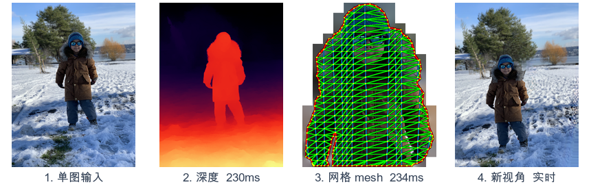

单图 → 深度 230ms → 分层 LDI 94ms + 遮挡补全 540 ms → 网格 234 ms → 新视角实时渲染

整条约 1.1 秒全在手机上跑完

## NeRF (2020–2023)

如果说 LDI 和 MPI 是把场景拆成“纸片”或“玻璃片”，NeRF(Neural Radiance Fields，神经辐射场)则换了一种更激进的思路：它不再直接保存图片、网格或一层层平面，而是把一个场景训练进一个神经网络里。

可以把 NeRF 理解成一个“记住了某个房间的函数”。你给它一个 3D 坐标，再告诉它从哪个方向看，它就回答两个问题：这里应该是什么颜色？这里有多像实体、会不会挡住后面的光？

网络输出的是颜色 RGB 和密度 σ。这里的密度可以先粗略理解成“这一点有多实”：σ 越大，说明这里越像有物体，越会遮挡后面的内容；σ 越小，说明这里更接近空气，光线可以穿过去。渲染一张图时，每个像素都会从相机发出一条光线，系统沿着这条光线采样很多个点，再把这些点的颜色和密度从近到远累积起来，最后得到这个像素的颜色。

这就是“辐射场”的含义：空间中的任意位置、任意观看方向，都可以被查询出颜色和密度。它的优势很明显：场景不再是几张离散纸片，而是一个连续的 3D 空间，所以新视角质量很高，细碎结构、透明感和随视角变化的光泽也更自然。它证明了，连续场可以用照片级质量表示真实 3D 场景。

<video src="assets/readme/lark-media-13.mp4" controls muted playsinline width="100%"></video>

[Instant-NGP](https://nvlabs.github.io/instant-ngp/) 证明可以靠哈希编码和 GPU 工程把训练压到分钟甚至秒级

但 NeRF 的原始形态并不适合“相册里点一张照片，马上生成 3D”。它通常需要多张带相机位姿的照片，每个场景都要单独训练；渲染时又要对每个像素、每条光线、每个采样点不断查询网络，计算量很大。NVIDIA 的 [Instant-NGP](https://arxiv.org/abs/2201.05989) 通过多分辨率哈希编码，把训练和渲染速度大幅拉快，证明这条路线可以被工程加速；但内容仍然藏在网络参数里，渲染仍然绕不开大量查询。

所以，NeRF 这一代对消费级单图 2D 转 3D 的直接贡献有限，但它留下了一个非常重要的观念：3D 表示不一定只能是图片层或网格，也可以是一个可连续查询的空间场。

字节跳动与新加坡国立大学的 [MINE](https://arxiv.org/abs/2103.14910) 可以理解成 MPI 和 NeRF 之间的过渡形态：不是传统 MPI，也不是原始 NeRF。传统 MPI 会预先设定一组固定深度，比如 32 个平行平面，然后一次性预测这 32 张 RGBA 图。它的问题是，场景只能被放在这些离散层上，深度表达比较粗。MINE 保留了 MPI “按深度生成平面”的思路，但把固定层改成了连续查询：你不再只能取第 1 层、第 2 层、第 32 层，而是可以给它任意一个连续深度 `z`，让网络生成这个深度位置上的一张 `(RGB, σ)` 平面。

所以 MINE 的意义在于它把 MPI 里离散的“层”，推进成了可以连续查询的“场”；但它又不像原始 NeRF 那样对每条光线逐点查询，而是仍然保留了平面化、前馈生成、便于补遮挡区域的产品友好形态。

[https://vincentfung13.github.io/projects/mine/](https://vincentfung13.github.io/projects/mine/)

## 3D Gaussian Splatting(2023–)

[3DGS](https://repo-sam.inria.fr/fungraph/3d-gaussian-splatting/) 换了一种更适合实时渲染的场景表示方式：它不再像 NeRF 那样把场景隐含在网络参数里，而是用大量带有位置、形状、颜色和透明度的 3D 高斯“小雾团”来近似真实世界。

渲染时，GPU 会把这些小雾团投影到屏幕上，变成一个个半透明的椭圆斑点，再按深度顺序进行透明叠加。这样一来，它能保留接近 NeRF 的画质，但不必在每个像素、每条光线上反复查询神经网络，而是回到 GPU 擅长的显式绘制流程，因此可以做到实时渲染：

|  |  |
| --- | --- |
| <video src="assets/readme/lark-media-14.mp4" controls muted playsinline width="100%"></video> | <video src="assets/readme/lark-media-15.mp4" controls muted playsinline width="100%"></video> |

3DGS：把场景表示成大量半透明 3D 高斯，渲染时把它们投影成屏幕上的椭圆斑点并透明合成

但它的代价主要在存储。一个真实场景往往需要百万级高斯，未压缩文件可能达到几十到几百 MB。因此，3DGS 要真正落到端侧，核心工程问题是“怎么把这些高斯剪枝、量化和压缩到设备能接受的规模”。

|  |  |
| --- | --- |
| Meta 在 Connect 2024 上演示了 [Hyperscape](https://www.meta.com/en-gb/blog/connect-2024-keynote-recap-quest-3s-llama-3-2-ai-wearables-mixed-reality/)：用 3DGS 将真实空间重建成可以走进去的照片级场景，再通过云端渲染串流到 Quest 3。到 2025 年，Meta 又开放了 Hyperscape Capture(Early Access)：用户只需要戴着头显扫描几分钟房间，云端经过数小时重建，就能把自己的客厅变成可分享的 VR 场景。   不过，它和 NeRF 时代的很多方案一样，仍然依赖多视角采集和逐场景重建。 | 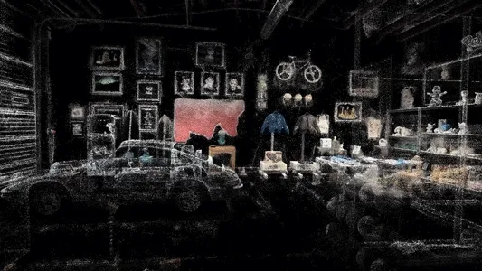 |

|  |  |
| --- | --- |
| 影视飓风有一个[相关视频](https://www.bilibili.com/video/BV1k85NzMEv4/)，它展示的不是普通静态 3DGS，而是 **4D Gaussian Splatting / 4DGS**。3DGS 里的“3D”指三维空间，它重建的是某一时刻的静态场景，观众可以在这个空间里自由换角度看；4DGS 则在三维空间之外加入时间维度，场景里的人、物和光影会继续运动，观众既能自由换视角，也能看到动作随时间发生。换句话说，3DGS 让照片级空间可以被自由运镜，4DGS 则把这种能力推进到视频级时空，让“正在发生的画面”也可以被自由运镜。 | 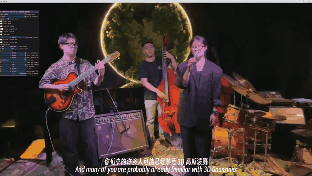 |

# 深度估计模型

上面几种表示法虽然形态不同，但都要先知道画面里每个像素大概离相机有多远。所以 2D 转 3D 这两年的进展，还有一条不那么显眼、但非常关键的暗线：**单目深度估计终于变得更通用、更稳定。**

早期的单目深度估计很挑照片。模型在熟悉的数据集里效果不错，换一种光线、换一种构图，或者遇到没见过的物体，就容易把远近判断错。[MiDaS](https://arxiv.org/abs/1907.01341) 和 [DPT](https://arxiv.org/abs/2103.13413) 这类工作先把目标放宽了一步：不急着估出“这个人离镜头 1.8 米”这样的绝对距离，而是先把**相对远近**排对，也就是判断谁更近、谁更远。再把不同来源的数据混在一起训练，模型就开始具备了“多数照片都能大致看懂远近”的泛化能力。

让产品更好的是 [Depth Anything V2](https://arxiv.org/abs/2406.09414)。它的训练方式更适合做成通用能力：先用大量合成图把一个大模型教得很强，再让这个大模型给真实照片自动标出深度答案，最后把能力压缩到小模型里。结果就是边缘更细、换照片更稳、模型体积也能压下来。V2 Small 只有 25M 参数，转成 Core ML 后几十 MB，已经足够作为手机端的轻量前处理步骤。

|  |  |
| --- | --- |
|  | 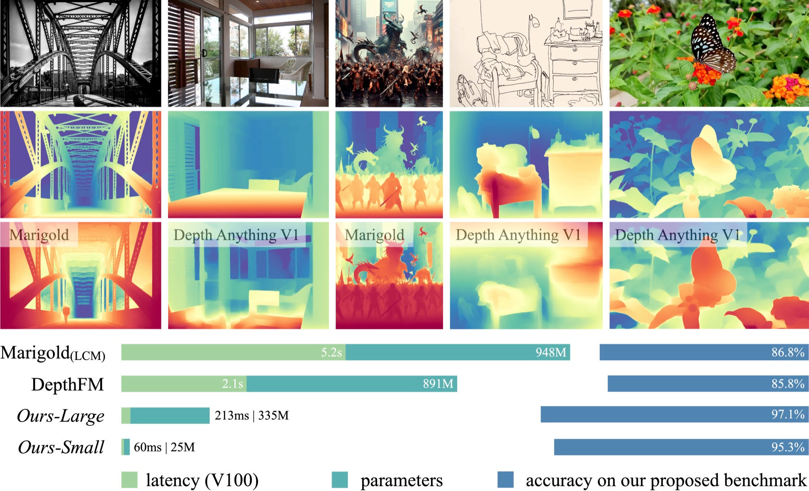 |

再往后，深度估计开始从“单张图里的远近排序”，走向更完整的空间理解。[Depth Pro](https://arxiv.org/abs/2410.02073) 强调的是**米制深度**，也就是不只判断谁近谁远，而是尽量估出接近真实世界的距离。[VGGT](https://arxiv.org/abs/2503.11651) 和 [Depth Anything 3](https://depth-anything-3.github.io/) 则进一步把问题扩展到整体几何：不仅预测深度，还尝试一次性推断相机位置、画面中各点的 3D 坐标，以及这些点在多帧之间如何运动。也就是说，深度估计正在从一个前处理模块，变成更通用的几何理解能力。

<video src="assets/readme/lark-media-20.mp4" controls muted playsinline width="100%"></video>

Depth Anything 3 支持从单视角到多视角的任意视角数量，实现完整视觉空间重建

# 技术原理

照片级 2D 转 3D 产品，可以理解成两段：**先离线生成一份可渲染的 3D 资产，再在预览时实时改变观察角度**。用户选中照片后，系统先完成深度估计、分层组织和遮挡补全；等用户倾斜手机或拖动画面时，GPU 只根据新的视角快速重绘：

1. **深度估计：**给照片生成一张深度图，判断哪些地方近、哪些地方远。对手机 3D 照片来说，通常不需要精确到真实米制距离，只要相对远近稳定，就能让近处移动得多、远处移动得少，形成视差；
2. **组织结构：**一张普通照片本来只是一个平面，不能从侧面看。系统需要根据深度，把主体、中景和背景拆开，或转换成图层、网格、高斯等可重新投影的表示，让它具备小幅换视角的能力；
3. **遮挡补全：**前景让开后，背后原本被挡住的内容并不存在于照片里。如果不补，就会出现空洞或纹理拉伸。手机 3D 照片的视差通常不大，要补的是主体轮廓旁露出的一圈窄带，包括颜色、深度；
4. **实时渲染：**前三步完成后，照片已经变成一份可交互资产。预览阶段，GPU 根据手势或陀螺仪重新投影这些图层或网格：近处移动多，远处移动少；主体边缘切开后，露出的就是补好的背景。

回到标题“空间重构”，它把这条流程推到更大的视角变化下使用。机位挪得越大，被推出画面、被前景遮住后重新露出的区域就越多，因此更依赖补全能力。难点是是如何让补出的颜色和深度自然接回原场景。

需要说明的是，Apple 目前并没有公开 Spatial Reframing 的具体实现细节。但从官方描述看，它解决的问题和一批公开研究高度一致：先从单张照片理解深度和空间结构，再根据用户拖动后的新机位生成新视角，最后只在新视角露出的缺失区域补内容。早期的 [3D Ken Burns Effect](https://arxiv.org/abs/1909.05483) 已经展示了“单图估深度、生成点云、移动虚拟相机、补齐露出区域”的完整链路；[3D Photo Inpainting](https://shihmengli.github.io/3D-Photo-Inpainting/) 则把问题进一步落到 LDI 分层和遮挡区域的颜色、深度补全；再往后，[Diffuse3D](https://github.com/yutaojiang1/Diffuse3D)、[Stable Virtual Camera](https://stable-virtual-camera.github.io/) 这类工作开始用扩散模型处理更大视角变化下的新视角生成。Spatial Reframing 可以看作这条研究路线在照片编辑产品里的落地。

|  |  |  |
| --- | --- | --- |
| <video src="assets/readme/lark-media-21.mp4" controls muted playsinline width="100%"></video> | <video src="assets/readme/lark-media-22.mp4" controls muted playsinline width="100%"></video> | <video src="assets/readme/lark-media-23.mp4" controls muted playsinline width="100%"></video> |

[3D Photography Using Context-Aware Layered Depth Inpainting](https://shihmengli.github.io/3D-Photo-Inpainting/)

# 从语言到 Demo

 AI Coding 让“从想法到产品雏形”的距离变短了，去年我尝试做类似项目，花了一个月只有粗糙雏形；今天只靠自然语言描述目标、配合 AI 自动反馈效果，就能在很短时间里把深度估计、遮挡补全和 Metal 渲染串成一个可交互 Demo。这大概就是属于工程师的 Demo 平权时代。

但 Coding 不只是为了得到一个结果，它本身也是理解问题的过程。就像 AI 可以替我们总结一本书，但亲自读一本书，你会在停顿、困惑、反驳和联想里形成自己的判断。写代码也是一样，AI 可以帮你更快跑通 Demo，但过程里暴露出来的取舍、错误和修正，才真正让你理解一个系统。

我们需要保留这种亲自探索的能力，塑造自己的判断，此文即由此而来。

以下是 **Arcus**([GitHub](https://github.com/LLLLLayer/arcus))，一个纯端侧 iOS 2D 转 3D 照片 Demo，技术路线接近 LDI；它先用 Depth Anything V2 Small 做单目深度估计，再用 Vision 前景分割拆出主体和背景，对遮挡区域用 MI-GAN / LaMa / PatchMatch 做补全，最后把前景、背景和深度做成可由 Metal 实时视差渲染的分层资产。最后也感谢模特蔡徐坤。

|  |  |  |  |  |  |
| --- | --- | --- | --- | --- | --- |
| 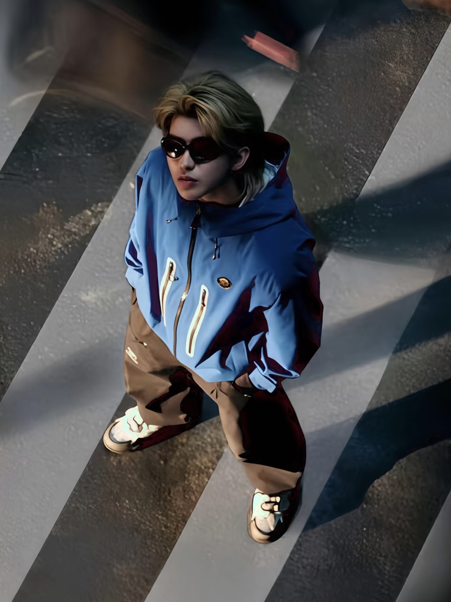 原图 |  深度 | 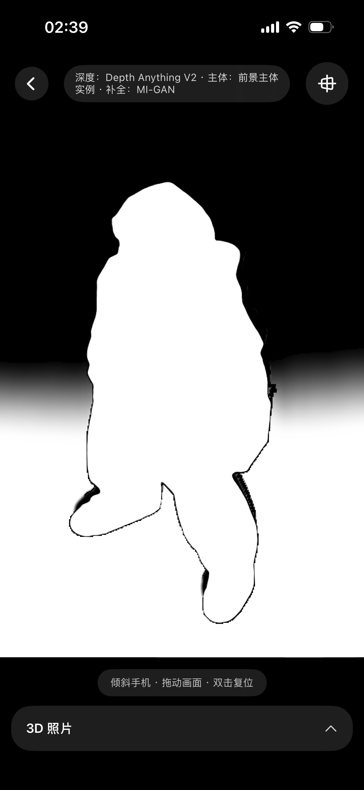 主体 |  背景 | <video src="assets/readme/lark-media-28.mp4" controls muted playsinline width="100%"></video> 空间照片 | <video src="assets/readme/lark-media-29.mp4" controls muted playsinline width="100%"></video> 空间重构 |

|  |  |  |  |  |  |
| --- | --- | --- | --- | --- | --- |
|  原图 | 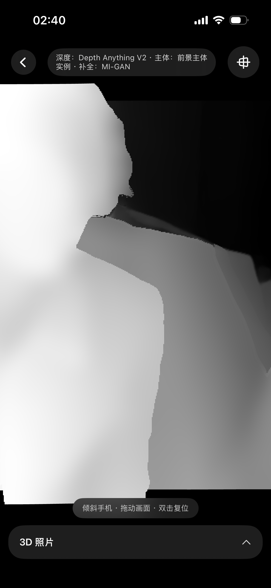 深度 | 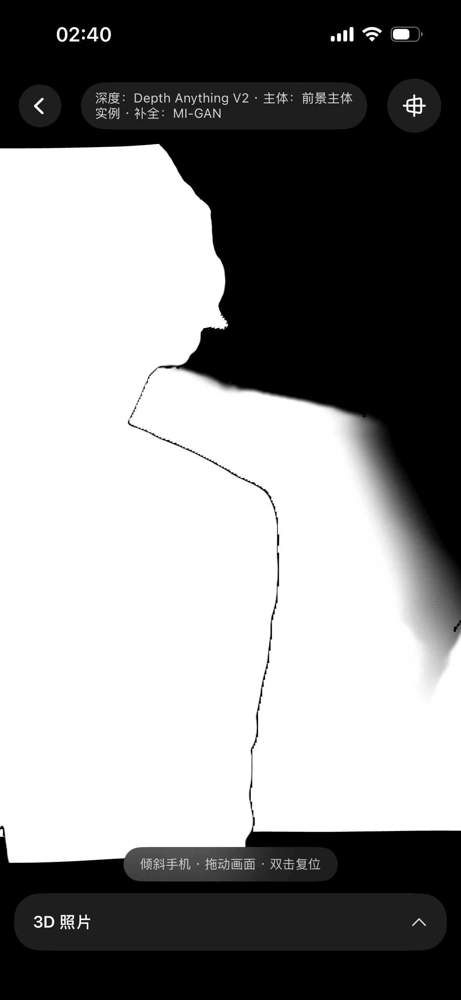 主体 |  背景 | <video src="assets/readme/lark-media-34.mp4" controls muted playsinline width="100%"></video> 空间照片 | <video src="assets/readme/lark-media-35.mp4" controls muted playsinline width="100%"></video> 空间重构 |

# 参考资料

**官方 / 产品**

1. WWDC26 Spatial Reframing：[Apple Newsroom](https://www.apple.com/newsroom/2026/06/apple-intelligence-brings-powerful-ai-capabilities-into-everyday-experiences/) · [AppleInsider](https://appleinsider.com/articles/26/06/08/spatial-reframing-will-fix-your-bad-iphone-photos-with-ios-27)
2. iOS 26 / visionOS 26 Spatial Scenes：[iOS 26 Newsroom](https://www.apple.com/newsroom/2025/06/apple-elevates-the-iphone-experience-with-ios-26/) · [visionOS 26 Newsroom](https://www.apple.com/newsroom/2025/06/visionos-26-introduces-powerful-new-spatial-experiences-for-apple-vision-pro/) · [RealityKit ImagePresentationComponent](https://developer.apple.com/documentation/realitykit/imagepresentationcomponent)
3. visionOS 2 空间照片：[Newsroom](https://www.apple.com/newsroom/2024/06/visionos-2-brings-new-spatial-computing-experiences-to-apple-vision-pro/)
4. Google Photos Cinematic Photos：[发布公告](https://blog.google/products/photos/new-cinematic-photos-and-more-ways-relive-your-memories/) · [技术博客](https://research.google/blog/the-technology-behind-cinematic-photos/)
5. Galaxy XR / Google Photos 空间化：[Google 官方](https://blog.google/products-and-platforms/platforms/android/samsung-galaxy-xr/) · [帮助页(云端处理)](https://support.google.com/photos/answer/16667814)
6. Android XR autospatialization：[预告(2025-12)](https://www.uploadvr.com/android-xr-getting-system-autospatialization-turn-any-content-3d/) · [实时窗口转 3D 落地(2026-04)](https://www.uploadvr.com/google-android-xr-2026-update-samsung-galaxy-xr/)
7. Meta Hyperscape：[Connect 2024 官方回顾](https://www.meta.com/blog/connect-2024-keynote-recap-quest-3s-llama-3-2-ai-wearables-mixed-reality/) · [Hyperscape Capture(TechCrunch)](https://techcrunch.com/2025/09/17/meta-launches-hyperscape-technology-to-turn-real-world-spaces-into-vr/)

**深度估计**

1. MiDaS：[arXiv 1907.01341](https://arxiv.org/abs/1907.01341) · DPT：[arXiv 2103.13413](https://arxiv.org/abs/2103.13413)
2. Depth Anything V2：[arXiv 2406.09414](https://arxiv.org/abs/2406.09414) · [Apple 官方 Core ML 转换](https://huggingface.co/apple/coreml-depth-anything-v2-small)
3. VGGT(CVPR'25 最佳论文)：[arXiv 2503.11651](https://arxiv.org/abs/2503.11651) · [GitHub](https://github.com/facebookresearch/vggt)
4. Depth Anything 3(字节 Seed)：[项目页](https://depth-anything-3.github.io/) · [arXiv 2511.10647](https://arxiv.org/abs/2511.10647)
5. Marigold(CVPR'24)：[项目页](https://marigoldmonodepth.github.io/) · RollingDepth(CVPR'25)：[项目页](https://rollingdepth.github.io/)
6. Apple Depth Pro：[arXiv 2410.02073](https://arxiv.org/abs/2410.02073) · [GitHub](https://github.com/apple/ml-depth-pro)

**补全 / 渲染 / 端侧**

1. LaMa(WACV'22)：[arXiv 2109.07161](https://arxiv.org/abs/2109.07161)
2. MI-GAN(ICCV'23)：[CVF Open Access](https://openaccess.thecvf.com/content/ICCV2023/html/Sargsyan_MI-GAN_A_Simple_Baseline_for_Image_Inpainting_on_Mobile_Devices_ICCV_2023_paper.html) · [GitHub](https://github.com/Picsart-AI-Research/MI-GAN)
3. MetalSplatter(iOS 3DGS 渲染)：[GitHub](https://github.com/scier/MetalSplatter)
4. 高通 QNN(HTP/NPU 运行时)：[文档](https://docs.qualcomm.com/doc/80-62010-1/topic/qnn.html)
5. 趣味延伸：[Autostereogram](https://en.wikipedia.org/wiki/Autostereogram) · [Wiggle stereoscopy](https://en.wikipedia.org/wiki/Wiggle_stereoscopy) · [Chromostereopsis](https://en.wikipedia.org/wiki/Chromostereopsis)

**相关研究工作**

<table><colgroup><col/><col/><col/><col/></colgroup><thead><tr><th vertical-align="top">工作</th><th vertical-align="top">年份/机构</th><th vertical-align="top">内容</th><th vertical-align="top">链接</th></tr></thead><tbody><tr><td colspan="4">LDI、MPI(1998–2022)</td></tr><tr><td vertical-align="top">Layered Depth Images(LDI)</td><td vertical-align="top">1998 · 微软研究院</td><td vertical-align="top">每条视线存多个带深度的像素，被遮挡内容也有地方放</td><td vertical-align="top"><a href="https://szeliski.org/papers/Shade_LayeredDepthImages_SG98.pdf">PDF</a></td></tr><tr><td vertical-align="top">Stereo Magnification / MPI</td><td vertical-align="top">2018 · Google</td><td vertical-align="top">一摞平行的半透明 RGBA 平面，网络从窄基线像对直接预测</td><td vertical-align="top"><a href="https://arxiv.org/abs/1805.09817">arXiv</a></td></tr><tr><td vertical-align="top">Facebook 3D Photos</td><td vertical-align="top">2018 · Facebook</td><td vertical-align="top">第一个大规模消费级落地(最初依赖双摄/人像深度)</td><td vertical-align="top">—</td></tr><tr><td vertical-align="top">3D Ken Burns</td><td vertical-align="top">2019 · Niklaus et al.</td><td vertical-align="top">单图 → 点云 → 相机推拉 + 补洞，自动生成视差视频</td><td vertical-align="top">—</td></tr><tr><td vertical-align="top">3D Photo Inpainting</td><td vertical-align="top">2020 · Shih et al.(CVPR)</td><td vertical-align="top">LDI + 深度边缘切开 + 上下文感知补全颜色和深度</td><td vertical-align="top"><a href="https://shihmengli.github.io/3D-Photo-Inpainting/">项目页</a> · <a href="https://arxiv.org/abs/2004.04727">arXiv</a></td></tr><tr><td vertical-align="top">One Shot 3D Photography</td><td vertical-align="top">2020 · Facebook(SIGGRAPH)</td><td vertical-align="top">单图、全端侧、几秒出片：深度网络 + LDI + 图集网格</td><td vertical-align="top"><a href="https://arxiv.org/abs/2008.12298">arXiv</a> · <a href="https://facebookresearch.github.io/one_shot_3d_photography/">项目页</a></td></tr><tr><td vertical-align="top">Cinematic Photos</td><td vertical-align="top">2020 · Google Photos</td><td vertical-align="top">depth mesh 分支：优化虚拟相机轨迹绕开补洞</td><td vertical-align="top"><a href="https://research.google/blog/the-technology-behind-cinematic-photos/">技术博客</a></td></tr><tr><td vertical-align="top">AdaMPI</td><td vertical-align="top">2022 · SIGGRAPH</td><td vertical-align="top">MPI 的平面深度自适应贴合场景</td><td vertical-align="top"><a href="https://arxiv.org/abs/2205.11733">arXiv</a></td></tr><tr><td colspan="4">NeRF (2020–2023)</td></tr><tr><td vertical-align="top">NeRF</td><td vertical-align="top">2020 · ECCV</td><td vertical-align="top">把场景训练进网络权重，沿光线查询并积分——连续场的质量标杆</td><td vertical-align="top"><a href="https://www.matthewtancik.com/nerf">项目页</a> · <a href="https://arxiv.org/abs/2003.08934">arXiv</a></td></tr><tr><td vertical-align="top">pixelNeRF</td><td vertical-align="top">2021 · CVPR</td><td vertical-align="top">从逐场景优化走向单图/少图前馈条件生成</td><td vertical-align="top"><a href="https://alexyu.net/pixelnerf/">项目页</a> · <a href="https://arxiv.org/abs/2012.02190">arXiv</a></td></tr><tr><td vertical-align="top">MINE</td><td vertical-align="top">2021 · 字节跳动/NUS(ICCV)</td><td vertical-align="top">MPI × NeRF：把固定层改造成可连续查询的深度场</td><td vertical-align="top"><a href="https://vincentfung13.github.io/projects/mine/">项目页</a> · <a href="https://arxiv.org/abs/2103.14910">arXiv</a></td></tr><tr><td vertical-align="top">Instant-NGP</td><td vertical-align="top">2022 · NVIDIA(SIGGRAPH 最佳论文)</td><td vertical-align="top">多分辨率哈希编码把训练从小时压到秒级</td><td vertical-align="top"><a href="https://arxiv.org/abs/2201.05989">arXiv</a> · <a href="https://github.com/NVlabs/instant-ngp">GitHub</a></td></tr><tr><td vertical-align="top">Mip-NeRF 360</td><td vertical-align="top">2022 · CVPR Oral</td><td vertical-align="top">从桌面小物体扩展到无边界真实 360° 场景</td><td vertical-align="top"><a href="https://jonbarron.info/mipnerf360/">项目页</a> · <a href="https://arxiv.org/abs/2111.12077">arXiv</a></td></tr><tr><td colspan="4">3D Gaussian Splatting(2023–)</td></tr><tr><td vertical-align="top">3D Gaussian Splatting(3DGS)</td><td vertical-align="top">2023 · Inria(SIGGRAPH 最佳论文)</td><td vertical-align="top">显式高斯 + 可微 splatting，画质对标 NeRF、速度回到实时</td><td vertical-align="top"><a href="https://repo-sam.inria.fr/fungraph/3d-gaussian-splatting/">项目页</a></td></tr><tr><td vertical-align="top">Splatter Image</td><td vertical-align="top">2023 · 牛津 VGG(CVPR'24)</td><td vertical-align="top">图像到图像网络，每像素回归一个高斯，重建 38fps</td><td vertical-align="top"><a href="https://arxiv.org/abs/2312.13150">arXiv</a></td></tr><tr><td vertical-align="top">Flash3D</td><td vertical-align="top">2024 · 牛津 VGG(3DV'25)</td><td vertical-align="top">第一层高斯贴预测深度 + 偏移层幻觉遮挡内容，单图零样本泛化</td><td vertical-align="top"><a href="https://arxiv.org/abs/2406.04343">arXiv</a></td></tr><tr><td vertical-align="top">Apple SHARP</td><td vertical-align="top">2025 · Apple</td><td vertical-align="top">单图前馈回归 metric(绝对米制)高斯，GPU &lt;1s、100+fps，LPIPS 较 SOTA 降 25–34%，开源</td><td vertical-align="top"><a href="https://apple.github.io/ml-sharp/">项目页</a> · <a href="https://arxiv.org/abs/2512.10685">arXiv</a> · <a href="https://github.com/apple/ml-sharp">GitHub</a></td></tr><tr><td vertical-align="top">CAT3D</td><td vertical-align="top">2024 · Google DeepMind(NeurIPS Oral)</td><td vertical-align="top">生成式视角合成：多视角扩散从单图想象一致新视角，约 1 分钟出片</td><td vertical-align="top"><a href="https://cat3d.github.io/">项目页</a> · <a href="https://arxiv.org/abs/2405.10314">arXiv</a></td></tr><tr><td vertical-align="top">World Labs Marble</td><td vertical-align="top">2025 · World Labs</td><td vertical-align="top">文本/单图/视频 → 可走入的高斯世界，可导出 splats/mesh 的商用产品</td><td vertical-align="top"><a href="https://www.worldlabs.ai/blog/marble-world-model">官方博客</a></td></tr></tbody></table>
